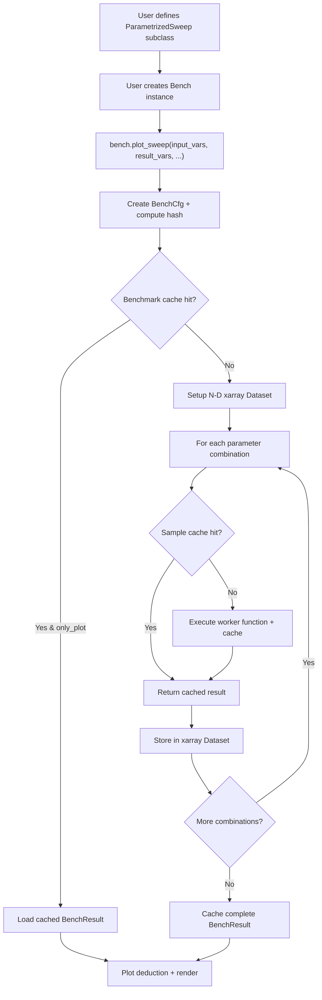

# 03 - Core Data Flow & Execution

## End-to-End Flow

1. **User defines a `ParametrizedSweep` subclass** (`bencher/variables/parametrised_sweep.py:13`)
   - Declares input parameters as class attributes using `IntSweep`, `FloatSweep`, `EnumSweep`, etc.
   - Declares result variables using `ResultVar`, `ResultImage`, etc.
   - Implements `__call__(self)` returning a dict of result values

2. **User creates a `Bench` instance** (`bencher/bencher.py:46-103`)
   - Accepts: `name`, `worker` (function or ParametrizedSweep instance), `worker_input_cfg`
   - Creates internal managers: `WorkerManager`, `SweepExecutor`, `ResultCollector`

3. **User calls `bench.plot_sweep()`** (`bencher/bencher.py:237-438`)
   - Calls `SweepExecutor.convert_vars_to_params()` to normalize variable specifications
   - Creates `BenchCfg` with all variables, configuration, and metadata

4. **`Bench.run_sweep()` executes** (`bencher/bencher.py:480-585`)
   - Computes persistent hash of `BenchCfg` via `hash_persistent()`
   - **Benchmark cache check**: looks up hash in `diskcache.Cache("cachedir/benchmark_inputs")`
   - Cache hit + `only_plot=True` → loads cached `BenchResult`, skips execution
   - Cache miss → proceeds to `calculate_benchmark_results()`

5. **`calculate_benchmark_results()`** (`bencher/bencher.py:649-741`)
   - `ResultCollector.setup_dataset()` initializes empty N-D `xarray.Dataset`
   - `SweepExecutor.init_sample_cache()` creates `FutureCache` with configured executor

6. **Job execution loop** (`bencher/bencher.py:694-730`)
   - For each parameter combination in the Cartesian product:
     - Creates `WorkerJob` → computes cache hashes → creates `Job`
     - `FutureCache.submit()`: **sample cache check** → hit returns cached result, miss executes function
     - `ResultCollector.store_results()` places values at correct N-D indices in xarray

7. **Result caching & plot deduction**
   - Persists complete `BenchResult` to benchmark cache
   - `PltCntCfg` classifies inputs as float vs categorical, counts repeats
   - Each plot type's `PlotFilter` evaluated → all matching plot types included (additive)
   - Panel layout assembled with auto-generated plots

## Key Decision Points

### Benchmark-Level Cache (Step 4)
- **Location**: `diskcache.Cache("cachedir/benchmark_inputs")`
- **Key**: SHA1 hash of `BenchCfg` (input/result vars, constants, name, tag)
- **Override**: `run_cfg.clear_cache=True` forces re-execution

### Sample-Level Cache (Step 6)
- **Location**: `diskcache.Cache("cachedir/sample_cache")` via `FutureCache`
- **Key**: SHA1 hash of sorted function inputs + tag
- **Override**: `run_cfg.overwrite_sample_cache=True` or `run_cfg.clear_sample_cache=True`

### Plot Type Selection (Step 7)
Priority order from `default_plot_callbacks()`:
1. Scatter (0 floats, 0+ cats, 1 repeat)
2. Line (1 float, 0+ cats, 1 repeat)
3. Heatmap (0+ floats, 0+ cats, 2+ inputs)
4. Volume (3 floats, 0 cats)
5. Distribution plots (when repeats > 1): BoxWhisker, Violin, ScatterJitter
6. Surface (2+ floats, 0+ cats)
7. VideoSummary, DataSet, Optuna

### Execution Strategy
- **Enum**: `Executors` (`job.py:132`) — `SERIAL` (default), `MULTIPROCESSING`, `SCOOP` (vestigial)
- `SERIAL` uses `ProcessPoolExecutor(max_workers=1)`, `MULTIPROCESSING` uses default workers
- Set via `run_cfg.executor`

## Worker Management

### WorkerManager accepts two patterns (`worker_manager.py:67-101`):
- **ParametrizedSweep instance**: uses `__call__` directly
- **Callable + worker_input_cfg**: wraps via `worker_cfg_wrapper()` to adapt kwargs to config pattern

### worker_kwargs_wrapper (`sweep_executor.py:23-44`):
Filters metadata keys (`repeat`, `over_time`, `time_event`) from kwargs before invoking the worker function unless `pass_repeat=True`.

### SampleOrder (`sample_order.py`):
Controls traversal order of the Cartesian product: `INORDER` (default) or `REVERSED`.

## Over-Time Tracking
If `run_cfg.over_time=True`, historical datasets are concatenated along the `over_time` dimension via `ResultCollector.load_history_cache()`. Clear with `run_cfg.clear_history=True`.
