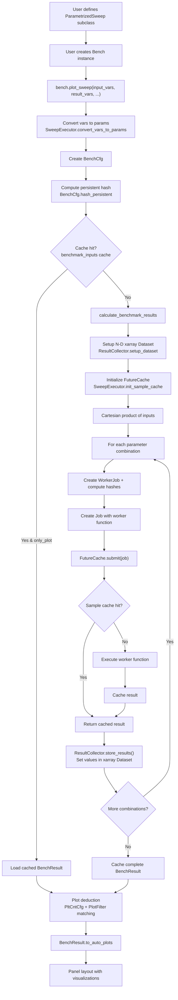

# 03 - Core Data Flow

## End-to-End Flow

### Step-by-Step

1. **User defines a `ParametrizedSweep` subclass** (`bencher/variables/parametrised_sweep.py:13`)
   - Declares input parameters as class attributes using `IntSweep`, `FloatSweep`, `EnumSweep`, etc.
   - Declares result variables as class attributes using `ResultVar`, `ResultImage`, etc.
   - Implements `__call__(self)` returning a dict of result values (`parametrised_sweep.py:199-205`)

2. **User creates a `Bench` instance** (`bencher/bencher.py:46-103`)
   - Accepts: `name`, `worker` (function or ParametrizedSweep instance), `worker_input_cfg`
   - Internally creates: `WorkerManager` (`worker_manager.py:49`), `SweepExecutor` (`sweep_executor.py:47`), `ResultCollector` (`result_collector.py:62`)
   - `WorkerManager.set_worker()` (`worker_manager.py:67-101`) validates and wraps the worker function

3. **User calls `bench.plot_sweep()`** (`bencher/bencher.py:237-438`)
   - Accepts: `input_vars`, `result_vars`, `const_vars`, `title`, `description`, `run_cfg`, etc.
   - Calls `SweepExecutor.convert_vars_to_params()` (`sweep_executor.py:67-124`) to normalize variable specifications
   - Creates `BenchCfg` with all variables, configuration, and metadata (`bench_cfg.py:305`)
   - Generates title from sweep variable names if not provided

4. **`Bench.run_sweep()` executes** (`bencher/bencher.py:480-585`)
   - Computes persistent hash of `BenchCfg` via `hash_persistent()` (`bench_cfg.py:429-467`)
   - **Cache check**: Looks up hash in `diskcache.Cache("cachedir/benchmark_inputs")`
   - If **cache hit** and `only_plot=True`: loads cached `BenchResult`, skips execution
   - If **cache miss** or `cache_results=False`: proceeds to `calculate_benchmark_results()`

5. **`Bench.calculate_benchmark_results()`** (`bencher/bencher.py:649-741`)
   - Calls `ResultCollector.setup_dataset()` (`result_collector.py:82-144`) which:
     - Adds meta variables (repeat, over_time) via `define_extra_vars()` (`result_collector.py:146-182`)
     - Creates `DimsCfg` from `BenchCfg` (`bench_cfg.py:659-695`)
     - Initializes empty N-dimensional `xarray.Dataset` with appropriate dtypes per result variable
     - Returns `BenchResult`, list of `function_inputs` (Cartesian product), and `dims_name`
   - Initializes `FutureCache` via `SweepExecutor.init_sample_cache()` (`sweep_executor.py:148-169`)

6. **Job creation and execution loop** (`bencher/bencher.py:694-730`)
   - For each parameter combination in `function_inputs`:
     - Creates `WorkerJob` dataclass (`worker_job.py:8`) with input values, indices, constants
     - Calls `WorkerJob.setup_hashes()` (`worker_job.py:46-67`) to compute cache signatures
     - Creates `Job` (`job.py:16`) wrapping the worker function via `worker_kwargs_wrapper` (`sweep_executor.py:23-44`)
     - Submits to `FutureCache.submit()` (`job.py:223-265`):
       - **Sample cache check**: looks up `job_key` in diskcache
       - If **cache hit**: returns `JobFuture` with cached result
       - If **cache miss**: executes function (serial or parallel), returns `JobFuture`
   - `JobFuture.result()` (`job.py:100-114`) resolves the future and optionally caches

7. **Result collection** (`bencher/bencher.py:743-751` via `ResultCollector.store_results()` at `result_collector.py:184-250`)
   - Unpacks result dict from worker function
   - Places values at correct N-d indices using `set_xarray_multidim()` (`result_collector.py:42-59`)
   - Handles different result types: scalar, vector, reference, dataset, media paths
   - Stores holoviews results in `hmaps` dict if applicable

8. **Result caching** (`result_collector.py:252-279`)
   - Persists complete `BenchResult` to disk cache using `bench_cfg.hash_persistent()` as key
   - Handles over_time history via `load_history_cache()` (`result_collector.py:281-313`)

9. **Plot deduction** (`bencher/results/bench_result.py:146-190`, `to_auto()`)
   - `PltCntCfg.generate_plt_cnt_cfg()` (`plotting/plt_cnt_cfg.py:36-80`) classifies input variables:
     - Float types: `IntSweep`, `FloatSweep`, `TimeSnapshot`
     - Categorical types: `EnumSweep`, `BoolSweep`, `StringSweep`, `YamlSweep`
   - Each plot type's `PlotFilter` specifies requirements (float count, cat count, repeats, etc.)
   - `BenchResultBase.filter()` (`bench_result_base.py:498-565`) evaluates `PlotMatchesResult`
   - `default_plot_callbacks()` (`bench_result.py:99-122`) defines the callback sequence

10. **Rendering** (`bencher/results/bench_result.py:192-205`, `to_auto_plots()`)
    - Assembles Panel layout with sweep summary, auto-generated plots, and post-description
    - Each matching plot callback produces a Panel pane via the result type's `to_plot()` method

## Mermaid Flow Diagram

## Key Decision Points

### 1. Benchmark-Level Cache (Step 4)
- **Location**: `diskcache.Cache("cachedir/benchmark_inputs")`
- **Key**: SHA1 hash of `BenchCfg` (includes all input/result variable definitions, sample counts, and tag)
- **Decision**: If `run_cfg.cache_results=True` and `run_cfg.only_plot=True`, skip execution entirely
- **Override**: `run_cfg.clear_cache=True` forces re-execution

### 2. Sample-Level Cache (Step 6)
- **Location**: `diskcache.Cache("cachedir/sample_cache")` via `FutureCache`
- **Key**: SHA1 hash of sorted function inputs + tag
- **Decision**: If cached result exists and `overwrite=False`, return immediately
- **Override**: `run_cfg.overwrite_sample_cache=True` or `run_cfg.clear_sample_cache=True`
- **Statistics**: Tracked via `call_count`, `worker_fn_call_count`, `worker_cache_call_count`

### 3. Plot Type Selection (Step 9)
- **Input**: `PltCntCfg` with counts of float vars, cat vars, result vars, panel vars, repeats
- **Decision**: Each plot type's `PlotFilter` specifies valid ranges for each dimension
- **Priority**: Callbacks are tried in order from `default_plot_callbacks()`:
  1. Scatter (0 floats, 0+ cats, 1 repeat)
  2. Line (1 float, 0+ cats, 1 repeat)
  3. Heatmap (0+ floats, 0+ cats, 2+ inputs)
  4. Volume (3 floats, 0 cats)
  5. Distribution plots (when repeats > 1): BoxWhisker, Violin, ScatterJitter
  6. Surface (2+ floats, 0+ cats)
  7. VideoSummary (for media results)
  8. DataSet (raw dataset view)
  9. Optuna (optimization plots)

### 4. Execution Strategy (Step 6)
- **Enum**: `Executors` (`job.py:132`)
- **Options**: `SERIAL` (ProcessPoolExecutor with 1 worker), `MULTIPROCESSING` (ProcessPoolExecutor), `SCOOP` (distributed)
- **Default**: `SERIAL`
- **Decision**: Set via `run_cfg.executor`

### 5. Over-Time Tracking (Step 8)
- **Decision**: If `run_cfg.over_time=True`, historical datasets are concatenated along the `over_time` dimension
- **History**: Loaded via `ResultCollector.load_history_cache()` (`result_collector.py:281-313`)
- **Clear**: `run_cfg.clear_history=True` discards previous data
