# 04 - Class Hierarchy

## Overview

This document enumerates every class in `bencher/` (excluding `bencher/example/`), grouped by subsystem with inheritance chains and file path references.

## Mermaid Class Diagram

```mermaid
classDiagram
    %% === CORE / ORCHESTRATION ===
    class Bench {
        bencher/bencher.py:46
    }
    class BenchRunner {
        bencher/bench_runner.py:35
    }
    class BenchPlotServer {
        bencher/bench_plot_server.py:16
    }

    BenchPlotServer <|-- Bench

    %% === CONFIGURATION ===
    class BenchPlotSrvCfg {
        bencher/bench_cfg.py:22
    }
    class BenchRunCfg {
        bencher/bench_cfg.py:43
    }
    class BenchCfg {
        bencher/bench_cfg.py:305
    }
    class DimsCfg {
        bencher/bench_cfg.py:659
    }

    param_Parameterized <|-- BenchPlotSrvCfg
    BenchPlotSrvCfg <|-- BenchRunCfg
    BenchRunCfg <|-- BenchCfg

    %% === VARIABLES: SWEEP TYPES ===
    class SweepBase {
        bencher/variables/sweep_base.py:50
    }
    class SweepSelector {
        bencher/variables/inputs.py:27
    }
    class IntSweep {
        bencher/variables/inputs.py:431
    }
    class FloatSweep {
        bencher/variables/inputs.py:508
    }
    class BoolSweep {
        bencher/variables/inputs.py:153
    }
    class StringSweep {
        bencher/variables/inputs.py:177
    }
    class EnumSweep {
        bencher/variables/inputs.py:241
    }
    class YamlSweep {
        bencher/variables/inputs.py:332
    }
    class TimeBase {
        bencher/variables/time.py:9
    }
    class TimeSnapshot {
        bencher/variables/time.py:42
    }
    class TimeEvent {
        bencher/variables/time.py:70
    }

    param_Parameter <|-- SweepBase
    SweepBase <|-- SweepSelector
    param_Selector <|-- SweepSelector
    SweepSelector <|-- BoolSweep
    SweepSelector <|-- StringSweep
    SweepSelector <|-- EnumSweep
    SweepSelector <|-- YamlSweep
    SweepBase <|-- IntSweep
    param_Integer <|-- IntSweep
    SweepBase <|-- FloatSweep
    param_Number <|-- FloatSweep
    SweepBase <|-- TimeBase
    param_Selector <|-- TimeBase
    TimeBase <|-- TimeSnapshot
    TimeBase <|-- TimeEvent

    %% === VARIABLES: RESULT TYPES ===
    class ResultVar {
        bencher/variables/results.py:20
    }
    class ResultBool {
        bencher/variables/results.py:40
    }
    class ResultVec {
        bencher/variables/results.py:61
    }
    class ResultHmap {
        bencher/variables/results.py:103
    }
    class ResultPath {
        bencher/variables/results.py:123
    }
    class ResultVideo {
        bencher/variables/results.py:139
    }
    class ResultImage {
        bencher/variables/results.py:151
    }
    class ResultString {
        bencher/variables/results.py:163
    }
    class ResultContainer {
        bencher/variables/results.py:175
    }
    class ResultReference {
        bencher/variables/results.py:187
    }
    class ResultDataSet {
        bencher/variables/results.py:210
    }
    class ResultVolume {
        bencher/variables/results.py:229
    }

    param_Number <|-- ResultVar
    param_Number <|-- ResultBool
    param_List <|-- ResultVec
    param_Parameter <|-- ResultHmap
    param_Filename <|-- ResultPath
    param_Filename <|-- ResultVideo
    param_Filename <|-- ResultImage
    param_String <|-- ResultString
    param_Parameter <|-- ResultContainer
    param_Parameter <|-- ResultReference
    param_Parameter <|-- ResultDataSet
    param_Parameter <|-- ResultVolume

    %% === VARIABLES: PARAMETRIZED SWEEP ===
    class ParametrizedSweep {
        bencher/variables/parametrised_sweep.py:13
    }
    class ParametrizedSweepSingleton {
        bencher/variables/singleton_parametrized_sweep.py:21
    }
    class CachedParams {
        bencher/caching.py:8
    }

    param_Parameterized <|-- ParametrizedSweep
    ParametrizedSweep <|-- ParametrizedSweepSingleton
    ParametrizedSweep <|-- CachedParams

    %% === EXECUTION ===
    class Job {
        bencher/job.py:16
    }
    class JobFuture {
        bencher/job.py:58
    }
    class FutureCache {
        bencher/job.py:169
    }
    class JobFunctionCache {
        bencher/job.py:320
    }
    class WorkerJob {
        bencher/worker_job.py:8
    }
    class WorkerManager {
        bencher/worker_manager.py:49
    }
    class SweepExecutor {
        bencher/sweep_executor.py:47
    }
    class ResultCollector {
        bencher/result_collector.py:62
    }

    FutureCache <|-- JobFunctionCache

    %% === RESULTS & VISUALIZATION ===
    class BenchResultBase {
        bencher/results/bench_result_base.py:82
    }
    class VideoResult {
        bencher/results/video_result.py:13
    }
    class VideoSummaryResult {
        bencher/results/video_summary.py:19
    }
    class VolumeResult {
        bencher/results/volume_result.py:13
    }
    class HistogramResult {
        bencher/results/histogram_result.py:16
    }
    class OptunaResult {
        bencher/results/optuna_result.py:30
    }
    class DataSetResult {
        bencher/results/dataset_result.py:12
    }
    class ExplorerResult {
        bencher/results/explorer_result.py:9
    }
    class HoloviewResult {
        bencher/results/holoview_results/holoview_result.py:27
    }
    class ScatterResult {
        bencher/results/holoview_results/scatter_result.py:15
    }
    class LineResult {
        bencher/results/holoview_results/line_result.py:19
    }
    class BarResult {
        bencher/results/holoview_results/bar_result.py:14
    }
    class CurveResult {
        bencher/results/holoview_results/curve_result.py:14
    }
    class HeatmapResult {
        bencher/results/holoview_results/heatmap_result.py:19
    }
    class SurfaceResult {
        bencher/results/holoview_results/surface_result.py:16
    }
    class TableResult {
        bencher/results/holoview_results/table_result.py:7
    }
    class TabulatorResult {
        bencher/results/holoview_results/tabulator_result.py:12
    }
    class DistributionResult {
        bencher/results/holoview_results/distribution_result/distribution_result.py:15
    }
    class BoxWhiskerResult {
        bencher/results/holoview_results/distribution_result/box_whisker_result.py:13
    }
    class ViolinResult {
        bencher/results/holoview_results/distribution_result/violin_result.py:13
    }
    class ScatterJitterResult {
        bencher/results/holoview_results/distribution_result/scatter_jitter_result.py:14
    }
    class BenchResult {
        bencher/results/bench_result.py:30
    }

    BenchResultBase <|-- VideoResult
    BenchResultBase <|-- VolumeResult
    BenchResultBase <|-- OptunaResult
    BenchResultBase <|-- DataSetResult
    BenchResultBase <|-- VideoSummaryResult
    VideoResult <|-- HoloviewResult
    VideoResult <|-- HistogramResult
    VideoResult <|-- ExplorerResult
    HoloviewResult <|-- ScatterResult
    HoloviewResult <|-- LineResult
    HoloviewResult <|-- BarResult
    HoloviewResult <|-- CurveResult
    HoloviewResult <|-- HeatmapResult
    HoloviewResult <|-- SurfaceResult
    HoloviewResult <|-- TableResult
    HoloviewResult <|-- TabulatorResult
    HoloviewResult <|-- DistributionResult
    DistributionResult <|-- BoxWhiskerResult
    DistributionResult <|-- ViolinResult
    DistributionResult <|-- ScatterJitterResult

    VolumeResult <|-- BenchResult
    BoxWhiskerResult <|-- BenchResult
    ViolinResult <|-- BenchResult
    ScatterJitterResult <|-- BenchResult
    ScatterResult <|-- BenchResult
    LineResult <|-- BenchResult
    BarResult <|-- BenchResult
    HeatmapResult <|-- BenchResult
    CurveResult <|-- BenchResult
    SurfaceResult <|-- BenchResult
    HoloviewResult <|-- BenchResult
    HistogramResult <|-- BenchResult
    VideoSummaryResult <|-- BenchResult
    DataSetResult <|-- BenchResult
    OptunaResult <|-- BenchResult

    %% === COMPOSABLE CONTAINERS ===
    class ComposableContainerBase {
        bencher/results/composable_container/composable_container_base.py:30
    }
    class ComposableContainerPanel {
        bencher/results/composable_container/composable_container_panel.py:7
    }
    class ComposableContainerVideo {
        bencher/results/composable_container/composable_container_video.py:58
    }
    class ComposableContainerDataset {
        bencher/results/composable_container/composable_container_dataframe.py:9
    }

    ComposableContainerBase <|-- ComposableContainerPanel
    ComposableContainerBase <|-- ComposableContainerVideo
    ComposableContainerBase <|-- ComposableContainerDataset

    %% === PLOTTING ===
    class PltCntCfg {
        bencher/plotting/plt_cnt_cfg.py:17
    }
    class PlotFilter {
        bencher/plotting/plot_filter.py:68
    }
    class VarRange {
        bencher/plotting/plot_filter.py:9
    }
    class PlotMatchesResult {
        bencher/plotting/plot_filter.py:95
    }

    param_Parameterized <|-- PltCntCfg

    %% === UTILITIES ===
    class ClassEnum {
        bencher/class_enum.py:12
    }
    class ExampleEnum {
        bencher/class_enum.py:95
    }
    class VideoWriter {
        bencher/video_writer.py:9
    }
    class VideoControls {
        bencher/results/video_controls.py:6
    }
    class FormatFloat {
        bencher/results/float_formatter.py:4
    }

    StrEnum <|-- ClassEnum
    ClassEnum <|-- ExampleEnum
```



## Classes Grouped by Subsystem

### Core / Orchestration

| Class | File:Line | Parent(s) | Purpose |
|-------|-----------|-----------|---------|
| `Bench` | `bencher/bencher.py:46` | `BenchPlotServer` | Main benchmarking engine; orchestrates sweeps, caching, result collection |
| `BenchRunner` | `bencher/bench_runner.py:35` | (none) | Higher-level interface for managing multiple benchmark runs |
| `BenchPlotServer` | `bencher/bench_plot_server.py:16` | (none) | Serves cached results via Panel web server |
| `BenchReport` | `bencher/bench_report.py:23` | `BenchPlotServer` | Generates HTML reports; publishes to GitHub Pages |
| `GithubPagesCfg` | `bencher/bench_report.py:16` | `@dataclass` | Configuration for GitHub Pages publishing |

### Protocols

| Protocol | File:Line | Purpose |
|----------|-----------|---------|
| `BenchableV1` | `bencher/bench_runner.py:14` | Legacy two-arg callable: `(run_cfg, report) -> BenchCfg` |
| `BenchableV2` | `bencher/bench_runner.py:24` | New one-arg callable: `(run_cfg) -> BenchCfg` |

> **NOTE:** `Benchable` is a `Union[BenchableV1, BenchableV2]` type alias (line 32), not a class.

### Configuration

| Class | File:Line | Parent(s) | Purpose |
|-------|-----------|-----------|---------|
| `BenchPlotSrvCfg` | `bencher/bench_cfg.py:22` | `param.Parameterized` | Plot server settings (port, show, ws_origin) |
| `BenchRunCfg` | `bencher/bench_cfg.py:43` | `BenchPlotSrvCfg` | Execution config (repeats, level, executor, caching, display options) |
| `BenchCfg` | `bencher/bench_cfg.py:305` | `BenchRunCfg` | Full benchmark protocol (input/result vars, constants, meta vars, hashing) |
| `DimsCfg` | `bencher/bench_cfg.py:659` | (none) | Extracts dimensionality info from a `BenchCfg` |

### Variables: Sweep Types (Input Parameters)

| Class | File:Line | Parent(s) | Purpose |
|-------|-----------|-----------|---------|
| `SweepBase` | `variables/sweep_base.py:50` | `param.Parameter` | Abstract base for all sweep types |
| `SweepSelector` | `variables/inputs.py:27` | `param.Selector`, `SweepBase` | Base for categorical sweep types |
| `IntSweep` | `variables/inputs.py:431` | `param.Integer`, `SweepBase` | Integer parameter sweep |
| `FloatSweep` | `variables/inputs.py:508` | `param.Number`, `SweepBase` | Float parameter sweep |
| `BoolSweep` | `variables/inputs.py:153` | `SweepSelector` | Boolean parameter sweep |
| `StringSweep` | `variables/inputs.py:177` | `SweepSelector` | String parameter sweep |
| `EnumSweep` | `variables/inputs.py:241` | `SweepSelector` | Enum parameter sweep |
| `YamlSweep` | `variables/inputs.py:332` | `SweepSelector` | YAML-driven parameter sweep |
| `YamlSelection` | `variables/inputs.py:286` | `str` | String subclass preserving YAML key+value |
| `TimeBase` | `variables/time.py:9` | `SweepBase`, `param.Selector` | Abstract base for time sweep types |
| `TimeSnapshot` | `variables/time.py:42` | `TimeBase` | Continuous time variable (datetime) |
| `TimeEvent` | `variables/time.py:70` | `TimeBase` | Discrete time event (categorical label) |

### Variables: Result Types (Output Variables)

| Class | File:Line | Parent(s) | Purpose |
|-------|-----------|-----------|---------|
| `ResultVar` | `variables/results.py:20` | `param.Number` | Scalar numeric result with OptDir |
| `ResultBool` | `variables/results.py:40` | `param.Number` | Boolean result in [0,1] range |
| `ResultVec` | `variables/results.py:61` | `param.List` | Fixed-size vector result |
| `ResultHmap` | `variables/results.py:103` | `param.Parameter` | HoloMap return value |
| `ResultPath` | `variables/results.py:123` | `param.Filename` | File path result |
| `ResultVideo` | `variables/results.py:139` | `param.Filename` | Video file result |
| `ResultImage` | `variables/results.py:151` | `param.Filename` | Image file result |
| `ResultString` | `variables/results.py:163` | `param.String` | String result |
| `ResultContainer` | `variables/results.py:175` | `param.Parameter` | Generic Panel container result |
| `ResultReference` | `variables/results.py:187` | `param.Parameter` | Arbitrary object reference result |
| `ResultDataSet` | `variables/results.py:210` | `param.Parameter` | Dataset result |
| `ResultVolume` | `variables/results.py:229` | `param.Parameter` | 3D volume data result |

### Variables: Framework

| Class | File:Line | Parent(s) | Purpose |
|-------|-----------|-----------|---------|
| `ParametrizedSweep` | `variables/parametrised_sweep.py:13` | `param.Parameterized` | Base class for user-defined sweep configurations |
| `ParametrizedSweepSingleton` | `variables/singleton_parametrized_sweep.py:21` | `ParametrizedSweep` | Singleton variant (one instance per subclass) |
| `CachedParams` | `bencher/caching.py:8` | `ParametrizedSweep` | Adds disk-based caching to any ParametrizedSweep |

### Execution

| Class | File:Line | Parent(s) | Purpose |
|-------|-----------|-----------|---------|
| `Job` | `bencher/job.py:16` | (none) | Function + args + cache key + tag |
| `JobFuture` | `bencher/job.py:58` | (none) | Thin wrapper over sync/async results with write-through caching |
| `FutureCache` | `bencher/job.py:169` | (none) | Central cache + executor system |
| `JobFunctionCache` | `bencher/job.py:320` | `FutureCache` | Convenience subclass binding to a single function |
| `WorkerJob` | `bencher/worker_job.py:8` | `@dataclass` | Single benchmark invocation with hashes and indices |
| `WorkerManager` | `bencher/worker_manager.py:49` | (none) | Worker function configuration and validation |
| `SweepExecutor` | `bencher/sweep_executor.py:47` | (none) | Variable conversion and cache initialization |
| `ResultCollector` | `bencher/result_collector.py:62` | (none) | xarray dataset creation, result storage, history loading |

### Enums

| Enum | File:Line | Parent(s) | Members |
|------|-----------|-----------|---------|
| `Executors` | `bencher/job.py:132` | `StrEnum` | `SERIAL`, `MULTIPROCESSING`, `SCOOP` |
| `SampleOrder` | `bencher/sample_order.py:5` | `StrEnum` | `INORDER`, `REVERSED` |
| `OptDir` | `variables/results.py:14` | `StrEnum` | `minimize`, `maximize`, `none` |
| `ReduceType` | `results/bench_result_base.py:41` | `Enum` | `AUTO`, `SQUEEZE`, `REDUCE`, `MINMAX`, `NONE` |
| `ComposeType` | `results/composable_container/composable_container_base.py:9` | `StrEnum` | `right`, `down`, `sequence`, `overlay` |
| `ClassEnum` | `bencher/class_enum.py:12` | `StrEnum` | Abstract factory enum pattern |
| `ExampleEnum` | `bencher/class_enum.py:95` | `ClassEnum` | Example: `Class1`, `Class2` |

### Results & Visualization

| Class | File:Line | Parent(s) | Purpose |
|-------|-----------|-----------|---------|
| `BenchResultBase` | `results/bench_result_base.py:82` | (none) | Core result handling, reduction, optimization |
| `VideoResult` | `results/video_result.py:13` | `BenchResultBase` | Video/panel pane rendering |
| `VideoSummaryResult` | `results/video_summary.py:19` | `BenchResultBase` | Summarized video grid outputs |
| `VolumeResult` | `results/volume_result.py:13` | `BenchResultBase` | 3D volume plots (Plotly) |
| `OptunaResult` | `results/optuna_result.py:30` | `BenchResultBase` | Optuna optimization visualization |
| `DataSetResult` | `results/dataset_result.py:12` | `BenchResultBase` | Raw panel-type result rendering |
| `ExplorerResult` | `results/explorer_result.py:9` | `VideoResult` | Interactive hvplot explorer |
| `HistogramResult` | `results/histogram_result.py:16` | `VideoResult` | Histogram distribution plots |
| `HoloviewResult` | `results/holoview_results/holoview_result.py:27` | `VideoResult` | Base for all HoloViews interactive plots |
| `ScatterResult` | `results/holoview_results/scatter_result.py:15` | `HoloviewResult` | 2D scatter plots |
| `LineResult` | `results/holoview_results/line_result.py:19` | `HoloviewResult` | Line/curve plots with tap interaction |
| `BarResult` | `results/holoview_results/bar_result.py:14` | `HoloviewResult` | Bar/column charts |
| `CurveResult` | `results/holoview_results/curve_result.py:14` | `HoloviewResult` | Smooth curve interpolations with std dev |
| `HeatmapResult` | `results/holoview_results/heatmap_result.py:19` | `HoloviewResult` | 2D heatmaps with tap interaction |
| `SurfaceResult` | `results/holoview_results/surface_result.py:16` | `HoloviewResult` | 3D surface plots |
| `TableResult` | `results/holoview_results/table_result.py:7` | `HoloviewResult` | HoloViews table |
| `TabulatorResult` | `results/holoview_results/tabulator_result.py:12` | `HoloviewResult` | Interactive Tabulator.js tables |
| `DistributionResult` | `results/holoview_results/distribution_result/distribution_result.py:15` | `HoloviewResult` | Base for distribution plots |
| `BoxWhiskerResult` | `results/holoview_results/distribution_result/box_whisker_result.py:13` | `DistributionResult` | Box-and-whisker plots |
| `ViolinResult` | `results/holoview_results/distribution_result/violin_result.py:13` | `DistributionResult` | Violin plots |
| `ScatterJitterResult` | `results/holoview_results/distribution_result/scatter_jitter_result.py:14` | `DistributionResult` | Jittered scatter distributions |

### BenchResult: Multiple Inheritance (Special Attention)

`BenchResult` (`bencher/results/bench_result.py:30-46`) uses **multiple inheritance from 15 parent classes**:

```python
class BenchResult(
    VolumeResult,          # 3D volume plots
    BoxWhiskerResult,      # Box-whisker distribution
    ViolinResult,          # Violin distribution
    ScatterJitterResult,   # Jittered scatter distribution
    ScatterResult,         # 2D scatter
    LineResult,            # Line plots with tap
    BarResult,             # Bar charts
    HeatmapResult,         # 2D heatmaps with tap
    CurveResult,           # Smooth curves
    SurfaceResult,         # 3D surfaces
    HoloviewResult,        # HoloViews base
    HistogramResult,       # Histograms
    VideoSummaryResult,    # Video grid summaries
    DataSetResult,         # Raw dataset panels
    OptunaResult,          # Optuna optimization
):
```

This is a deliberate design choice: `BenchResult` acts as a **mixin aggregator** so that any result can be cast to any visualization type via the `to()` method. The MRO (Method Resolution Order) determines which `to_plot()` gets called when methods overlap.

> **NOTE:** The `__init__` explicitly calls `VolumeResult.__init__` and `HoloviewResult.__init__` rather than using `super()`, which is unusual for cooperative multiple inheritance but avoids MRO issues with the deep hierarchy.

### Composable Containers

| Class | File:Line | Parent(s) | Purpose |
|-------|-----------|-----------|---------|
| `ComposableContainerBase` | `results/composable_container/composable_container_base.py:30` | `@dataclass` | Abstract base for composable renderers |
| `ComposableContainerPanel` | `results/composable_container/composable_container_panel.py:7` | `ComposableContainerBase` | Panel-based layout composition |
| `ComposableContainerVideo` | `results/composable_container/composable_container_video.py:58` | `ComposableContainerBase` | Video composition (moviepy) |
| `ComposableContainerDataset` | `results/composable_container/composable_container_dataframe.py:9` | `ComposableContainerBase` | Dataset-based composition |
| `RenderCfg` | `results/composable_container/composable_container_video.py:24` | `@dataclass` | Video rendering configuration |

### Plotting

| Class | File:Line | Parent(s) | Purpose |
|-------|-----------|-----------|---------|
| `PltCntCfg` | `bencher/plotting/plt_cnt_cfg.py:17` | `param.Parameterized` | Counts float/cat/panel vars for plot matching |
| `PlotFilter` | `bencher/plotting/plot_filter.py:68` | `@dataclass` | Defines acceptable ranges for plot type matching |
| `VarRange` | `bencher/plotting/plot_filter.py:9` | (none) | Bounded/unbounded integer range for filter matching |
| `PlotMatchesResult` | `bencher/plotting/plot_filter.py:95` | (none) | Stores filter match results with debug info |

### Utilities

| Class | File:Line | Parent(s) | Purpose |
|-------|-----------|-----------|---------|
| `ClassEnum` | `bencher/class_enum.py:12` | `StrEnum` | Abstract factory pattern: enum value -> class instance |
| `ExampleEnum` | `bencher/class_enum.py:95` | `ClassEnum` | Example implementation mapping to Class1/Class2 |
| `BaseClass` | `bencher/class_enum.py:61` | `@dataclass` | Base class for ClassEnum example |
| `Class1` | `bencher/class_enum.py:74` | `BaseClass` | Example subclass 1 |
| `Class2` | `bencher/class_enum.py:85` | `BaseClass` | Example subclass 2 |
| `VideoWriter` | `bencher/video_writer.py:9` | (none) | Image sequence to video conversion (moviepy) |
| `VideoControls` | `bencher/results/video_controls.py:6` | (none) | Interactive video playback widgets |
| `FormatFloat` | `bencher/results/float_formatter.py:4` | (none) | Fixed-width float formatting |
| `EmptyContainer` | `results/bench_result_base.py:49` | (none) | None-filtering append wrapper for Panel containers |

### Helper Classes (Internal)

| Class | File:Line | Parent(s) | Purpose |
|-------|-----------|-----------|---------|
| `_DynamicValuesSentinel` | `variables/inputs.py:16` | `str` | Sentinel for dynamic value loading |

## Inheritance Chains Summary

### Longest Chain: BenchResult

```
param.Parameter
  -> SweepBase (abstract)               # sweep_base.py:50
param.Parameterized
  -> BenchPlotSrvCfg                    # bench_cfg.py:22
    -> BenchRunCfg                      # bench_cfg.py:43
      -> BenchCfg                       # bench_cfg.py:305

(none)
  -> BenchPlotServer                    # bench_plot_server.py:16
    -> Bench                            # bencher.py:46

(none)
  -> BenchResultBase                    # bench_result_base.py:82
    -> VideoResult                      # video_result.py:13
      -> HoloviewResult                 # holoview_result.py:27
        -> DistributionResult           # distribution_result.py:15
          -> BoxWhiskerResult           # box_whisker_result.py:13
            -> BenchResult              # bench_result.py:30  (via MI)
```

### Multiple Inheritance Diamonds

1. **Sweep types**: `IntSweep(Integer, SweepBase)` and `FloatSweep(Number, SweepBase)` both inherit from `param.Parameter` via different paths.
2. **SweepSelector**: `SweepSelector(Selector, SweepBase)` inherits from `param.Parameter` via both `Selector` and `SweepBase`.
3. **TimeBase**: `TimeBase(SweepBase, Selector)` - same diamond as SweepSelector.
4. **BenchResult**: 15 parent classes converge on `BenchResultBase` through `VideoResult` and direct inheritance, creating a complex diamond.

## Total Class Count

| Subsystem | Classes | Enums |
|-----------|---------|-------|
| Core / Orchestration | 5 | 0 |
| Configuration | 4 | 0 |
| Variables: Sweep Types | 11 | 0 |
| Variables: Result Types | 12 | 1 (`OptDir`) |
| Variables: Framework | 3 | 0 |
| Execution | 8 | 2 (`Executors`, `SampleOrder`) |
| Results & Visualization | 21 | 2 (`ReduceType`, `ComposeType`) |
| Composable Containers | 5 | 0 |
| Plotting | 4 | 0 |
| Utilities | 8 | 2 (`ClassEnum`, `ExampleEnum`) |
| **Total** | **81** | **7** |
