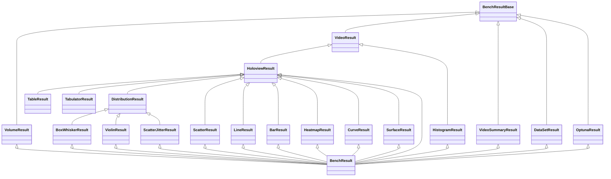

# 06 - Results & Visualization System

## BenchResult Inheritance



## BenchResultBase (`bencher/results/bench_result_base.py:82-753`)

Core base class for all benchmark results.

### Key Attributes
- `bench_cfg: BenchCfg` - Benchmark configuration
- `ds: xr.Dataset` - N-dimensional result dataset
- `object_index: list` - Storage for ResultReference objects
- `hmaps: dict` - HoloViews HoloMap storage
- `plt_cnt_cfg: PltCntCfg` - Plot count configuration
- `dataset_list` - ResultDataSet storage
- `studies: list` - Optuna study list

### Core Methods

| Method | Line | Purpose |
|--------|------|---------|
| `to_xarray()` | 101-102 | Returns raw xarray Dataset |
| `to_pandas()` | 107-114 | Converts dataset to pandas DataFrame |
| `to_hv_dataset()` | 148-185 | Creates HoloViews Dataset with optional reduction |
| `to_dataset()` | 187-288 | Low-level dataset conversion with ReduceType handling |
| `filter()` | 498-565 | Evaluates PlotFilter against current data dimensions |
| `map_plots()` | 410-420 | Maps plot callback over result variables |
| `map_plot_panes()` | 462-496 | Creates multi-panel visualizations |
| `_to_panes_da()` | 587-643 | Recursive N-dimensional layout builder |
| `to_panes_multi_panel()` | 567-585 | Multi-dimensional panel creator |
| `get_optimal_value_indices()` | 318-334 | Finds indices of optimal values |
| `get_optimal_inputs()` | 336-371 | Returns optimal input parameters |
| `ds_to_container()` | 661-687 | Converts dataset to Panel containers |
| `select_level()` | 689-726 | Static method for level-based filtering |

## Visualization Types

### ScatterResult (`bencher/results/holoview_results/scatter_result.py:15-107`)
- **Data shape**: 0 float inputs, 0+ categorical inputs, 1 repeat
- **PlotFilter**: `float_range: 0-0, cat_range: 0-None, repeats: 1-1`
- **Output**: HoloViews Points/Scatter overlay
- **Methods**: `to_scatter()` (43-73)

### LineResult (`bencher/results/holoview_results/line_result.py:19-241`)
- **Data shape**: 1 float input, 0+ categorical inputs, 1 repeat
- **PlotFilter**: `float_range: 1-1, cat_range: 0-None, repeats: 1-1`
- **Output**: HoloViews Curve with optional tap interaction
- **Methods**: `to_line()` (65-119), `to_line_ds()` (121-142), `to_line_tap_ds()` (144-240)
- **Interactive**: Uses `PointerXY`, `MouseLeave` streams for tap events

### HeatmapResult (`bencher/results/holoview_results/heatmap_result.py:19-326`)
- **Data shape**: 0+ float, 0+ categorical, 2+ total inputs
- **PlotFilter**: `float_range: 0-None, cat_range: 0-None, input_range: 2-None`
- **Output**: HoloViews HeatMap with optional tap containers
- **Methods**: `to_heatmap()` (68-126), `to_heatmap_ds()` (128-154), `to_heatmap_container_tap_ds()` (156-247), `to_heatmap_tap()` (291-325)
- **Interactive**: Tap on cell to show detailed container content

### SurfaceResult (`bencher/results/holoview_results/surface_result.py`)
- **Data shape**: 2+ float inputs, 0+ categorical
- **Output**: 3D Plotly surface plot

### VolumeResult (`bencher/results/volume_result.py:13-107`)
- **Data shape**: Exactly 3 float inputs, 0 categorical
- **PlotFilter**: `float_range: 3-3, cat_range: -1-0`
- **Output**: 3D Plotly volume visualization
- **Methods**: `to_volume()` (34-66), `to_volume_ds()` (68-107)

### BarResult (`bencher/results/holoview_results/bar_result.py`)
- **Data shape**: Categorical inputs with numeric results
- **Output**: HoloViews Bars

### CurveResult (`bencher/results/holoview_results/curve_result.py`)
- **Data shape**: Similar to LineResult
- **Output**: Smooth interpolated curves

### TableResult / TabulatorResult (`bencher/results/holoview_results/table_result.py`, `tabulator_result.py`)
- **Output**: Tabular display of data (static or interactive Tabulator.js)

### Distribution Results

#### BoxWhiskerResult (`bencher/results/holoview_results/distribution_result/box_whisker_result.py`)
- **Data shape**: Any inputs, repeats > 1
- **Output**: Box-and-whisker plots showing median, quartiles, outliers

#### ViolinResult (`bencher/results/holoview_results/distribution_result/violin_result.py`)
- **Data shape**: Any inputs, repeats > 1
- **Output**: Violin plots showing full distribution shape

#### ScatterJitterResult (`bencher/results/holoview_results/distribution_result/scatter_jitter_result.py`)
- **Data shape**: Any inputs, repeats > 1
- **Output**: Jittered scatter showing individual measurements

### HistogramResult (`bencher/results/histogram_result.py`)
- **Data shape**: Numeric results with distributions
- **Output**: Histogram frequency distribution

### VideoResult (`bencher/results/video_result.py:13-41`)
- **Data shape**: Results containing ResultVideo/ResultImage
- **Output**: Video playback with controls via `VideoControls`

### VideoSummaryResult (`bencher/results/video_summary.py`)
- **Data shape**: Results containing media (images/videos)
- **Output**: Labeled video/image summary grid with composable containers

### DataSetResult (`bencher/results/dataset_result.py`)
- **Data shape**: Any (always available)
- **Output**: Raw xarray dataset exploration view

### ExplorerResult (`bencher/results/explorer_result.py`)
- **Data shape**: Any
- **Output**: Interactive hvplot data explorer

### OptunaResult (`bencher/results/optuna_result.py:30-287`)
- **Data shape**: Any (requires Optuna integration)
- **Output**: Optimization history, parameter importance, Pareto front
- **Methods**: `to_optuna_from_sweep()` (40-44), `to_optuna_from_results()` (46-81), `bench_results_to_optuna_trials()` (83-152), `collect_optuna_plots()` (178-264)

## ComposableContainer System (`bencher/results/composable_container/`)

### ComposeType (`composable_container_base.py:9-26`)
Enum controlling layout direction:
- `right` - Horizontal arrangement
- `down` - Vertical arrangement
- `sequence` - Sequential order
- `overlay` - Overlaid elements
- `flip()` method swaps right/down

### ComposableContainerBase (`composable_container_base.py:29-73`)
- **Attributes**: `compose_method`, `container` (list), `label_len`
- **`label_formatter()`** (37-57): Static method for fixed-width labels
- **`append()`** (59-65): Adds non-None objects
- **`render()`** (67-73): Override point for rendering

### ComposableContainerPanel (`composable_container_panel.py:6-40`)
- Panel-based layout with `name`, `var_name`, `var_value`, `width`, `background_col`
- Creates `panel.Row` or `panel.Column` with CSS styling

### ComposableContainerDataframe (`composable_container_dataframe.py`)
- DataFrame-based composition

### ComposableContainerVideo (`composable_container_video.py`)
- Video-based composition with `RenderCfg` for render settings

## PlotFilter System (`bencher/plotting/plot_filter.py`)

### VarRange (`plot_filter.py:9-64`)
Bounded integer range for matching dimensionality:
- `lower_bound`, `upper_bound` (None = unbounded)
- `matches(value)` (21-45): Returns True if value in range
- Used for each dimension: float count, cat count, vector length, etc.

### PlotFilter (`plot_filter.py:67-92`)
Dataclass specifying requirements for a plot type:
- `float_range: VarRange` - Required float variable count
- `cat_range: VarRange` - Required categorical count
- `vector_len: VarRange` - Vector result length (default 1-1)
- `result_vars: VarRange` - Number of result variables (default 1-1)
- `panel_range: VarRange` - Panel result count (default 0-0)
- `repeats_range: VarRange` - Number of repeats (default 1-None)
- `input_range: VarRange` - Total input count (default 1-None)

### PlotMatchesResult (`plot_filter.py:95-156`)
Stores matching evaluation results:
- `overall: bool` - Whether all criteria match
- `matches_info: str` - Detailed match description
- `to_panel()` (144-156): Returns debug Markdown pane

## ReduceType Enum (`bencher/results/bench_result_base.py:41-46`)

Controls how repeated measurements are aggregated:

| Value | Effect |
|-------|--------|
| `AUTO` | Automatic selection based on repeat count |
| `SQUEEZE` | Remove dimensions of length 1 |
| `REDUCE` | Mean + standard deviation over repeat dimension |
| `MINMAX` | Min/max range over repeat dimension |
| `NONE` | No reduction |

## Plot Deduction Algorithm

The plot deduction process in `BenchResult.to_auto()` (`bench_result.py:146-190`):

1. **Compute PltCntCfg** via `generate_plt_cnt_cfg()` (`plt_cnt_cfg.py:36-80`):
   - Classify each input as float (`IntSweep`, `FloatSweep`, `TimeSnapshot`) or categorical (`EnumSweep`, `BoolSweep`, `StringSweep`, `YamlSweep`)
   - Count panel-type results (`PANEL_TYPES`)
   - Record repeat count

2. **Get default callbacks** from `default_plot_callbacks()` (`bench_result.py:99-122`):
   ```
   scatter, line, heatmap, volume, box_whisker, violin, scatter_jitter,
   surface, video_summary, dataset, optuna
   ```

3. **For each callback**: Call `filter()` (`bench_result_base.py:498-565`) which:
   - Evaluates the callback's `PlotFilter` against `PltCntCfg`
   - Creates `PlotMatchesResult` with pass/fail for each criterion
   - If `overall=True`, include in output

4. **For each matching callback**: Execute `to_plot()` or equivalent method
   - Methods like `to_scatter()`, `to_line()`, `to_heatmap()` produce Panel panes
   - Panes are collected into the output list

5. **Wrap results** in `to_auto_plots()` (`bench_result.py:192-205`):
   - Prepend sweep summary description
   - Append post-description
   - Return Panel column layout

> **NOTE:** The algorithm is additive - all matching plot types are included, not just the best match. This means a 2D dataset might get both a heatmap and a surface plot.
