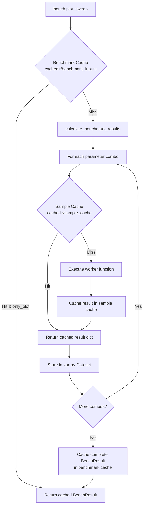

# 07 - Caching Architecture

## Overview

Bencher uses a two-tier caching system built on `diskcache`. Both tiers use SHA1 hashes as keys and persistent disk storage.



## Layer 1: Sample Cache (Function-Level)

### What It Caches
Individual function call results - the dict returned by the worker function for a single parameter combination.

### Storage Backend
- **Class**: `FutureCache` (`bencher/job.py:169-317`)
- **Backend**: `diskcache.Cache` at `cachedir/sample_cache`
- **Size limit**: 100GB default (`SweepExecutor.__init__`, `sweep_executor.py:58-65`)

### Key Structure
- **Key computation**: `WorkerJob.setup_hashes()` (`worker_job.py:46-67`)
  1. Combines input variable values + constant inputs into `function_input` dict
  2. Sorts items: `fn_inputs_sorted = sorted(function_input.items())`
  3. Pure input hash: `function_input_signature_pure = hash_sha1(str(fn_inputs_sorted) + tag)`
  4. Benchmark context hash: `function_input_signature_benchmark_context = hash_sha1(str(fn_inputs_sorted) + bench_cfg_sample_hash + tag)`
- **Used key**: `function_input_signature_pure` (default) or `function_input_signature_benchmark_context`

### Cache Hit/Miss Flow (`job.py:223-265`, `FutureCache.submit()`)
```python
def submit(self, job):
    self.call_count += 1
    if not self.overwrite and job.job_key in self.cache:
        # CACHE HIT
        self.worker_cache_call_count += 1
        result = self.cache[job.job_key]
        return JobFuture(job=job, res=result)
    else:
        # CACHE MISS - execute
        self.worker_fn_call_count += 1
        if executor_type == SERIAL:
            result = run_job(job)
            return JobFuture(job=job, res=result, cache=self.cache)
        else:
            future = self.executor.submit(run_job, job)
            return JobFuture(job=job, future=future, cache=self.cache)
```

### Statistics Tracked
| Counter | Purpose |
|---------|---------|
| `call_count` | Total submit calls |
| `worker_wrapper_call_count` | Wrapper invocations |
| `worker_fn_call_count` | Actual function executions (cache misses) |
| `worker_cache_call_count` | Cache hits |

### Configuration Options

| Option | Location | Default | Effect |
|--------|----------|---------|--------|
| `cache_samples` | `BenchRunCfg` (`bench_cfg.py`) | `True` | Enable/disable sample caching |
| `clear_sample_cache` | `BenchRunCfg` | `False` | Clear all sample cache before run |
| `overwrite_sample_cache` | `BenchRunCfg` | `False` | Force re-execution, overwrite cached |
| `only_hash_tag` | `BenchRunCfg` | `False` | Use tag-only hashing for cache key |

## Layer 2: Benchmark Cache (Sweep-Level)

### What It Caches
Complete `BenchResult` objects containing the full N-dimensional xarray Dataset and all metadata.

### Storage Backend
- **Backend**: `diskcache.Cache("cachedir/benchmark_inputs")` (created in `BenchPlotServer`, accessed in `bencher.py`)
- **Size limit**: Default diskcache limits

### Key Structure
- **Key computation**: `BenchCfg.hash_persistent()` (`bench_cfg.py:429-467`)
  1. Concatenates hash values of: input_vars, result_vars, const_vars, name, tag
  2. If `pass_repeat=False`, excludes repeat count from hash
  3. Final: `hash_sha1(combined_string)`
- **Index**: `bench_name` → list of `bench_cfg_hash` values (for plot server lookup)

### Cache Hit/Miss Flow (`bencher.py:480-585`, `run_sweep()`)
```python
def run_sweep(bench_cfg, run_cfg):
    hash_val = bench_cfg.hash_persistent()

    if run_cfg.clear_cache:
        # Remove from cache
        cache.pop(hash_val)

    if hash_val in cache and run_cfg.only_plot:
        # CACHE HIT - load previous result
        bench_res = cache[hash_val]
        return bench_res

    # CACHE MISS - execute full benchmark
    bench_res = calculate_benchmark_results(bench_cfg, run_cfg)

    if run_cfg.cache_results:
        # Store result
        cache[hash_val] = bench_res
```

### Configuration Options

| Option | Location | Default | Effect |
|--------|----------|---------|--------|
| `cache_results` | `BenchRunCfg` | `True` | Enable benchmark-level caching |
| `clear_cache` | `BenchRunCfg` | `False` | Remove cached result before run |
| `only_plot` | `BenchRunCfg` | `False` | Skip execution if cached, just re-plot |

## Layer 3: History Cache (Time-Series)

### What It Caches
Historical datasets for over_time tracking, allowing visualization of how results change across runs.

### Storage Backend
Same `diskcache.Cache("cachedir/benchmark_inputs")` as Layer 2, with different keys.

### Behavior (`result_collector.py:281-313`, `load_history_cache()`)
- Loads previous datasets for the same input variable hash
- Concatenates old and new datasets along `over_time` dimension using `xr.concat`
- Controlled by `run_cfg.over_time=True`
- `run_cfg.clear_history=True` discards all previous data

## WorkerJob Caching Metadata (`bencher/worker_job.py:8-67`)

Each `WorkerJob` carries caching-relevant data:

| Attribute | Purpose |
|-----------|---------|
| `function_input_vars` | Raw input variable values |
| `constant_inputs` | Dict of constant parameter values |
| `bench_cfg_sample_hash` | Hash of the benchmark config for context-aware caching |
| `tag` | Grouping tag (included in hash) |
| `function_input` | Combined dict of all inputs (dims + constants) |
| `fn_inputs_sorted` | Sorted input items for deterministic hashing |
| `function_input_signature_pure` | Hash of just inputs + tag |
| `function_input_signature_benchmark_context` | Hash including benchmark context |
| `found_in_cache` | Boolean flag set after cache lookup |
| `msgs` | Execution messages including cache status |

## Legacy Caching (`bencher/caching.py:8-48`)

`CachedParams` extends `ParametrizedSweep` with a simpler diskcache wrapper:

| Method | Purpose |
|--------|---------|
| `kwargs_to_hash_key()` | Converts kwargs to sortable tuple for hashing |
| `in_cache()` | Checks if input combination exists in cache |
| `cache_wrap()` | Wraps function calls with transparent caching |

> **NOTE:** `CachedParams` appears to be a legacy mechanism. The primary caching system uses `FutureCache` and `ResultCollector` cache methods described above.

## Cache Directory Structure

```
cachedir/
├── benchmark_inputs/     # Layer 2: Complete BenchResult objects
│   └── (diskcache files)
├── sample_cache/         # Layer 1: Individual function call results
│   └── (diskcache files)
├── vid/                  # Generated video files
├── img/                  # Generated image files
├── rrd/                  # Rerun data files
└── generic/              # Other generated files
```
