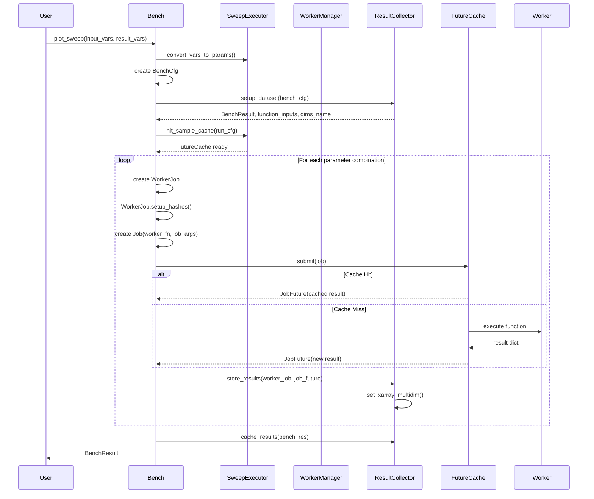
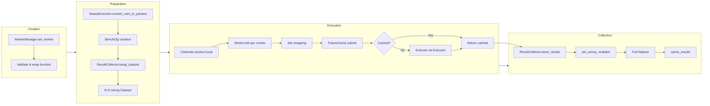

# 08 - Execution Model

## Job Lifecycle



## Executors Enum (`bencher/job.py:132-166`)

```python
class Executors(StrEnum):
    SERIAL = auto()          # Sequential (ProcessPoolExecutor, max_workers=1)
    MULTIPROCESSING = auto() # Parallel (ProcessPoolExecutor, default workers)
    SCOOP = auto()           # Distributed (SCOOP framework - commented out)
```

### Factory Method (`job.py:144-166`)
```python
@staticmethod
def factory(executor_type, **kwargs):
    if executor_type == Executors.SERIAL:
        return ProcessPoolExecutor(max_workers=1)
    elif executor_type == Executors.MULTIPROCESSING:
        return ProcessPoolExecutor(**kwargs)
    elif executor_type == Executors.SCOOP:
        return None  # SCOOP uses futures.submit directly
```

> **NOTE:** SCOOP support appears to be vestigial - the import is commented out and the executor returns None. Only SERIAL and MULTIPROCESSING are actively used.

## WorkerManager (`bencher/worker_manager.py:49-148`)

Manages worker function configuration and validation.

### set_worker() (`worker_manager.py:67-101`)

Accepts two patterns:

**Pattern 1: ParametrizedSweep instance**
```python
if isinstance(worker, ParametrizedSweep):
    self.worker_class_instance = worker
    self.worker = worker  # Uses __call__
```

**Pattern 2: Callable + worker_input_cfg**
```python
if callable(worker) and worker_input_cfg:
    self.worker_class_instance = worker_input_cfg()
    self.worker = worker_cfg_wrapper(worker, self.worker_class_instance)
```

Where `worker_cfg_wrapper()` (`worker_manager.py:31-46`) adapts a function expecting kwargs to work with the ParametrizedSweep config pattern.

### Validation
- Raises `RuntimeError` if `worker` is a class instead of an instance (line 86-89)
- Stores `worker_class_instance` for parameter introspection

### Helper Functions

`kwargs_to_input_cfg()` (`worker_manager.py:16-28`): Creates a configured ParametrizedSweep instance from kwargs:
```python
def kwargs_to_input_cfg(input_cfg, kwargs):
    instance = input_cfg()
    for key, value in kwargs.items():
        setattr(instance, key, value)
    return instance
```

## SweepExecutor (`bencher/sweep_executor.py:47-206`)

Handles variable conversion and cache initialization.

### convert_vars_to_params() (`sweep_executor.py:67-124`)

Converts various input formats to `param.Parameter` objects:

| Input Format | Handling |
|-------------|----------|
| `str` | Lookup by name on `worker_class_instance` |
| `dict` | Extract name, values, samples, max_level from dict |
| `param.Parameter` | Use directly |
| `tuple` | Treat as constant variable |

Dict format supports:
```python
{"name": "var_name", "values": [...], "samples": N, "max_level": M}
```

### init_sample_cache() (`sweep_executor.py:148-169`)
Creates `FutureCache` with configured executor type and cache settings:
```python
def init_sample_cache(self, run_cfg):
    self.sample_cache = FutureCache(
        executor_type=run_cfg.executor,
        cache_name="sample_cache",
        overwrite=run_cfg.overwrite_sample_cache,
        size_limit=self.cache_size
    )
```

### worker_kwargs_wrapper() (`sweep_executor.py:23-44`)

Module-level function that wraps the worker to filter metadata parameters before invocation:
```python
def worker_kwargs_wrapper(fn, pass_repeat, **kwargs):
    # Remove metadata keys unless pass_repeat=True
    for key in ["repeat", "over_time", "time_event"]:
        if not pass_repeat:
            kwargs.pop(key, None)
    return fn(**kwargs)
```

## FutureCache (`bencher/job.py:169-317`)

Unified caching and execution system.

### Initialization (`job.py:188-221`)
- Creates `diskcache.Cache` at `cachedir/{cache_name}`
- Creates executor via `Executors.factory()`
- Initializes call count statistics

### submit() Flow (`job.py:223-265`)

```
1. Increment call_count
2. Check: overwrite=False AND job.job_key in cache?
   → YES: Return JobFuture(res=cached_result)     [cache hit]
   → NO: Execute function
         If SERIAL: result = run_job(job)
         If PARALLEL: future = executor.submit(run_job, job)
         Return JobFuture(res/future, cache=self.cache)
3. JobFuture.result() caches the result on first access
```

### Cache Management Methods

| Method | Line | Purpose |
|--------|------|---------|
| `clear_call_counts()` | 277-281 | Reset all statistics |
| `clear_cache()` | 283-286 | Clear all entries |
| `clear_tag(tag)` | 288-296 | Clear entries by tag prefix |
| `close()` | 298-304 | Close cache and executor |
| `stats()` | 306-317 | Return usage statistics dict |

## Job and JobFuture (`bencher/job.py:16-129`)

### Job (`job.py:16-55`)
Represents a single benchmark invocation:
- `job_id`: Unique identifier for logging
- `function`: Callable to execute
- `job_args`: Dict of arguments
- `job_key`: Auto-generated hash from `job_args` (via `hash_sha1`)
- `tag`: Grouping tag

### JobFuture (`job.py:58-114`)
Wraps job result with deferred caching:
- Must have either `res` (immediate result) or `future` (async future)
- `result()` method: resolves future if needed, caches result, returns dict

### run_job() (`job.py:117-129`)
Simple execution function:
```python
def run_job(job):
    return job.function(**job.job_args)
```

## ResultCollector (`bencher/result_collector.py:62-359`)

### setup_dataset() (`result_collector.py:82-144`)

Creates the N-dimensional xarray Dataset:

1. Calls `define_extra_vars()` (146-182) to add meta variables:
   - `repeat` IntSweep if `repeats > 1`
   - `over_time` TimeSnapshot if `over_time=True`
   - `time_event` TimeEvent if provided

2. Creates `DimsCfg` from `BenchCfg` (`bench_cfg.py:659-695`):
   - Extracts dimension names, ranges, sizes, coordinates
   - Used for xarray coordinate construction

3. Initializes empty `xarray.Dataset`:
   - One DataArray per result variable
   - Dtype: `float` for ResultVar/ResultBool, `object` for others (paths, containers)
   - Shape: Cartesian product of all dimension sizes

4. Returns: `(BenchResult, function_inputs, dims_name)`
   - `function_inputs`: List of dicts, one per parameter combination
   - `dims_name`: List of dimension names

### store_results() (`result_collector.py:184-250`)

Stores a single job's results into the dataset:

```python
def store_results(self, worker_job, job_future):
    result = job_future.result()
    for rv in bench_cfg.result_vars:
        if rv.name in result:
            value = result[rv.name]
            if isinstance(rv, XARRAY_MULTIDIM_RESULT_TYPES):
                set_xarray_multidim(ds, rv.name, worker_job.index_tuple, value)
            elif isinstance(rv, ResultVec):
                # Expand vector to individual columns
            elif isinstance(rv, ResultReference):
                # Store in object_index list
            elif isinstance(rv, ResultDataSet):
                # Store in dataset_list
```

### set_xarray_multidim() (`result_collector.py:42-59`)

Sets a value at an N-dimensional index in the xarray Dataset:
```python
def set_xarray_multidim(dataset, var_name, index_tuple, value):
    dataset[var_name].values[index_tuple] = value
```

## SampleOrder (`bencher/sample_order.py:5-17`)

Controls traversal order for the Cartesian product:

| Value | Effect |
|-------|--------|
| `INORDER` | Natural Cartesian product order (rightmost dimension varies fastest) |
| `REVERSED` | Reversed traversal of the same set |

Used in `Bench.calculate_benchmark_results()` to optionally reverse the function_inputs list before iteration.

## Execution Flow Summary


