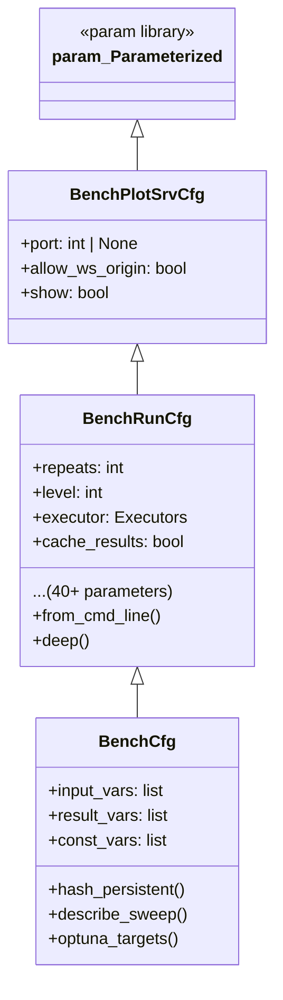
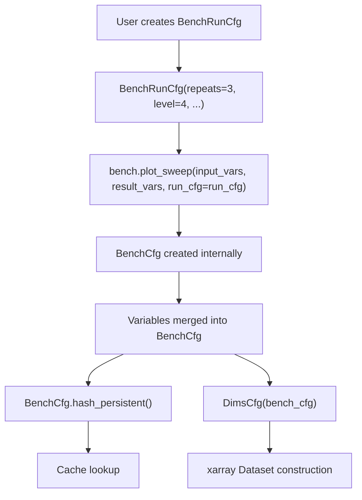

# 09 - Configuration System

## Inheritance Chain



## BenchPlotSrvCfg (`bencher/bench_cfg.py:22-40`)

Base configuration for the Panel plot server.

| Parameter | Type | Default | Effect |
|-----------|------|---------|--------|
| `port` | `int \| None` | `None` | Panel web server port (None = auto-assign) |
| `allow_ws_origin` | `bool` | `False` | Add port to WebSocket origin whitelist |
| `show` | `bool` | `True` | Automatically open browser on serve |

## BenchRunCfg (`bencher/bench_cfg.py:43-302`)

Complete configuration for benchmark execution. Extends `BenchPlotSrvCfg`.

### Execution Parameters

| Parameter | Type | Default | Effect |
|-----------|------|---------|--------|
| `repeats` | `int` | `1` | Number of times to repeat each parameter combination |
| `level` | `int` | `2` | Sampling level (controls number of samples per sweep variable) |
| `executor` | `Executors` | `SERIAL` | Execution strategy: SERIAL, MULTIPROCESSING, SCOOP |
| `nightly` | `bool` | `False` | Enable nightly (extended) benchmark mode |
| `headless` | `bool` | `False` | Run in headless mode (no UI) |

### Caching Parameters

| Parameter | Type | Default | Effect |
|-----------|------|---------|--------|
| `cache_results` | `bool` | `True` | Enable benchmark-level result caching |
| `cache_samples` | `bool` | `True` | Enable sample-level function call caching |
| `clear_cache` | `bool` | `False` | Clear benchmark cache before run |
| `clear_sample_cache` | `bool` | `False` | Clear sample cache before run |
| `overwrite_sample_cache` | `bool` | `False` | Force re-execution, overwrite cached samples |
| `only_hash_tag` | `bool` | `False` | Use tag-only hashing for sample cache keys |
| `only_plot` | `bool` | `False` | Skip execution if cached result exists, just re-plot |

### Display Parameters

| Parameter | Type | Default | Effect |
|-----------|------|---------|--------|
| `print_bench_inputs` | `bool` | `False` | Print benchmark input parameters to console |
| `print_bench_results` | `bool` | `False` | Print benchmark results to console |
| `summarise_constant_inputs` | `bool` | `True` | Include constant inputs in sweep description |
| `print_pandas` | `bool` | `False` | Print results as pandas DataFrame |
| `print_xarray` | `bool` | `False` | Print results as xarray Dataset |
| `serve_pandas` | `bool` | `False` | Serve pandas DataFrame via Panel |
| `serve_pandas_flat` | `bool` | `False` | Serve flattened pandas DataFrame |
| `serve_xarray` | `bool` | `False` | Serve xarray Dataset via Panel |

### Visualization Parameters

| Parameter | Type | Default | Effect |
|-----------|------|---------|--------|
| `auto_plot` | `bool` | `True` | Automatically generate plots based on data shape |
| `use_holoview` | `bool` | `True` | Use HoloViews for interactive plots |
| `use_optuna` | `bool` | `False` | Include Optuna optimization plots |
| `render_plotly` | `bool` | `True` | Enable Plotly rendering for 3D plots |
| `plot_size` | `int` | `None` | Override plot size (both width and height) |
| `plot_width` | `int` | `None` | Override plot width |
| `plot_height` | `int` | `None` | Override plot height |
| `raise_duplicate_exception` | `bool` | `True` | Raise exception on duplicate variable names |

### Time/History Parameters

| Parameter | Type | Default | Effect |
|-----------|------|---------|--------|
| `over_time` | `bool` | `False` | Track results over time (concatenate with historical data) |
| `clear_history` | `bool` | `False` | Clear historical data before run |
| `time_event` | `str \| None` | `None` | Discrete time event label (e.g., git commit hash) |
| `run_tag` | `str` | `""` | Tag for grouping related runs |
| `run_date` | `datetime \| None` | `None` | Timestamp for the run (auto-set to current time) |

### Methods

| Method | Line | Purpose |
|--------|------|---------|
| `__init__()` | 243-247 | Sets `run_date` to current time if not provided |
| `from_cmd_line()` | 249-299 | Static method: parses command-line arguments into BenchRunCfg |
| `deep()` | 301-302 | Returns deep copy of the configuration |

### Command-Line Arguments (`from_cmd_line()`, line 249-299)

| Argument | Maps To | Default |
|----------|---------|---------|
| `-r`, `--repeats` | `repeats` | 1 |
| `-l`, `--level` | `level` | 2 |
| `-as`, `--auto-show` | `show` | False |
| `--headless` | `headless` | False |
| `-ot`, `--over-time` | `over_time` | False |

## BenchCfg (`bencher/bench_cfg.py:305-656`)

Full benchmark configuration combining execution config with sweep parameters. Extends `BenchRunCfg`.

### Variable Parameters

| Parameter | Type | Default | Effect |
|-----------|------|---------|--------|
| `input_vars` | `list` | `[]` | Input variables to sweep over |
| `result_vars` | `list` | `[]` | Result variables to collect |
| `const_vars` | `list` | `[]` | Constant variable values (list of tuples) |
| `result_hmaps` | `list` | `[]` | HoloViews result map variables |
| `meta_vars` | `list` | `[]` | Meta variables (repeat count, timestamps) |
| `all_vars` | `list` | `[]` | Combined: input_vars + meta_vars |
| `iv_time` | `param.Parameter \| None` | `None` | Time-based input parameter |
| `iv_time_event` | `param.Parameter \| None` | `None` | Time event parameter |

### Metadata Parameters

| Parameter | Type | Default | Effect |
|-----------|------|---------|--------|
| `name` | `str` | `""` | Benchmark name |
| `title` | `str \| None` | `None` | Display title (auto-generated if None) |
| `bench_name` | `str` | `""` | Parent bench name |
| `description` | `str \| None` | `None` | Description text |
| `post_description` | `str \| None` | `None` | Post-results description |
| `has_results` | `bool` | `True` | Whether results are expected |
| `pass_repeat` | `bool` | `False` | Pass repeat index to worker function |
| `tag` | `str` | `""` | Tag for cache partitioning |
| `hash_value` | `str` | `""` | Computed persistent hash |
| `plot_callbacks` | `list` | `None` | Custom plot callback functions |

### Internal State

| Parameter | Type | Default | Effect |
|-----------|------|---------|--------|
| `plot_lib` | `dict \| None` | `None` | Plot library configuration |
| `hmap_kdims` | `list \| None` | `None` | HoloMap key dimensions |
| `iv_repeat` | `IntSweep \| None` | `None` | Repeat index variable |

### Key Methods

| Method | Line | Purpose |
|--------|------|---------|
| `__init__()` | 418-427 | Initializes plot_lib, hmap_kdims, iv_repeat |
| `hash_persistent()` | 429-467 | SHA1 hash for caching: includes vars, name, tag; excludes repeats if !pass_repeat |
| `inputs_as_str()` | 469-475 | Returns formatted input variable names |
| `to_latex()` | 477-483 | LaTeX representation of sweep |
| `describe_sweep()` | 485-506 | Markdown summary with optional accordion wrapper |
| `sweep_sentence()` | 508-524 | One-line summary: "Sweeping X over [values] ..." |
| `describe_benchmark()` | 526-565 | Detailed description of all variables |
| `to_title()` | 567-577 | Panel Markdown title |
| `to_description()` | 579-588 | Panel Markdown description |
| `to_post_description()` | 590-600 | Panel Markdown post-description |
| `to_sweep_summary()` | 602-637 | Panel column with sweep description, constants, and hash |
| `optuna_targets()` | 639-656 | Returns list of (direction, name) for Optuna optimization |

### hash_persistent() Details (`bench_cfg.py:429-467`)

The persistent hash is the core of the caching system:

```python
def hash_persistent(self):
    hash_str = ""
    for iv in self.input_vars:
        hash_str += iv.hash_persistent()
    for rv in self.result_vars:
        hash_str += rv.hash_persistent()
    for cv_name, cv_val in self.const_vars:
        hash_str += hash_sha1(str(cv_name) + str(cv_val))
    hash_str += self.name + self.tag
    if not self.pass_repeat:
        # Exclude repeat count so different repeat counts share cache
        pass
    self.hash_value = hash_sha1(hash_str)
    return self.hash_value
```

## DimsCfg (`bencher/bench_cfg.py:659-695`)

Stores dimension information extracted from a `BenchCfg` instance. Created during `ResultCollector.setup_dataset()`.

### Attributes

| Attribute | Type | Purpose |
|-----------|------|---------|
| `dims_name` | `list[str]` | Names of all dimensions |
| `dim_ranges` | `list[list]` | Values for each dimension |
| `dims_size` | `list[int]` | Number of values per dimension |
| `dim_ranges_index` | `list[list[int]]` | Index lists (0..n-1) per dimension |
| `dim_ranges_str` | `list[list[str]]` | String representations of each value |
| `coords` | `dict` | Mapping: dimension name → values (for xarray construction) |

### Construction (`bench_cfg.py:675-695`)

```python
def __init__(self, bench_cfg):
    for iv in bench_cfg.all_vars:
        vals = iv.values()
        self.dims_name.append(iv.name)
        self.dim_ranges.append(vals)
        self.dims_size.append(len(vals))
        self.dim_ranges_index.append(list(range(len(vals))))
        self.dim_ranges_str.append([str(v) for v in vals])
        self.coords[iv.name] = vals
```

## Configuration Flow


