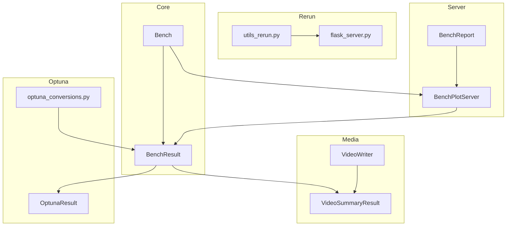

# 10 - Integrations

## Optuna Integration

### Files
- `bencher/optuna_conversions.py` (170 lines)
- `bencher/results/optuna_result.py` (287 lines)

### Purpose
Converts bencher sweep parameters to Optuna distributions for hyperparameter optimization, and provides visualization of optimization results (history, importance, Pareto front).

### Type Conversions (`optuna_conversions.py:83-141`)

| Bencher Type | Optuna Distribution | Function |
|-------------|---------------------|----------|
| `IntSweep` | `IntDistribution(low, high)` | `sweep_var_to_optuna_dist()` (83-113) |
| `FloatSweep` | `FloatDistribution(low, high)` | `sweep_var_to_optuna_dist()` |
| `EnumSweep`/`StringSweep` | `CategoricalDistribution(choices)` | `sweep_var_to_optuna_dist()` |
| `BoolSweep` | `CategoricalDistribution([False, True])` | `sweep_var_to_optuna_dist()` |
| `TimeSnapshot` | `FloatDistribution(0, 1e20)` | `sweep_var_to_optuna_dist()` |

### Key Functions

| Function | File:Line | Purpose |
|----------|-----------|---------|
| `optuna_grid_search()` | `optuna_conversions.py:23-44` | Creates Optuna GridSampler study from BenchCfg |
| `param_importance()` | `optuna_conversions.py:48-57` | Panel column with parameter importance plots |
| `summarise_trial()` | `optuna_conversions.py:61-80` | Formats trial as list of strings |
| `sweep_var_to_optuna_dist()` | `optuna_conversions.py:83-113` | Converts sweep var to Optuna distribution |
| `sweep_var_to_suggest()` | `optuna_conversions.py:116-141` | Converts sweep var to trial suggestion |
| `cfg_from_optuna_trial()` | `optuna_conversions.py:144-152` | Creates ParametrizedSweep from Optuna trial |
| `summarise_optuna_study()` | `optuna_conversions.py:155-169` | Panel with optimization history, importance, Pareto front |

### OptunaResult Class (`optuna_result.py:30-287`)

| Method | Line | Purpose |
|--------|------|---------|
| `to_optuna_plots()` | 31-38 | Generate Optuna visualization plots |
| `to_optuna_from_sweep()` | 40-44 | Run Optuna optimization from sweep definition |
| `to_optuna_from_results()` | 46-81 | Create Optuna study from existing benchmark results |
| `bench_results_to_optuna_trials()` | 83-152 | Convert xarray dataset entries to Optuna FrozenTrial objects |
| `bench_result_to_study()` | 154-166 | Create Study from benchmark results |
| `get_best_trial_params()` | 168-173 | Extract best trial parameter values |
| `collect_optuna_plots()` | 178-264 | Generate multi-objective visualization suite |

### Optimization Capabilities
- **Single-objective**: Minimize/maximize a single ResultVar
- **Multi-objective**: Pareto front for multiple ResultVars with OptDir
- **Samplers**: TPESampler (Bayesian), GridSampler (exhaustive)
- **Visualization**: History plot, parameter importance, Pareto front, contour plots

## Rerun Integration

### Files
- `bencher/utils_rerun.py` (59 lines)
- `bencher/flask_server.py` (26 lines)

### Purpose
Integrates the Rerun 3D/2D visualization SDK for logging spatial data, embedding Rerun viewers in Panel dashboards, and publishing `.rrd` files.

### Functions (`utils_rerun.py`)

| Function | Line | Purpose |
|----------|------|---------|
| `_get_rerun_version()` | 10-15 | Detect installed rerun-sdk version (default 0.29.2) |
| `rerun_to_pane()` | 18-26 | Render current Rerun recording as Panel widget using `rerun_notebook.Viewer` |
| `rrd_to_pane()` | 29-38 | Display `.rrd` file via hosted Rerun web viewer (iframe) |
| `publish_and_view_rrd()` | 41-51 | Publish RRD file to git branch and embed viewer |
| `capture_rerun_window()` | 54-58 | Capture Rerun window screenshot for notebook display |

### Flask Server (`flask_server.py`)

| Function | Line | Purpose |
|----------|------|---------|
| `create_server()` | 7-16 | Create Flask app with CORS for local file serving |
| `run_flask_in_thread()` | 19-26 | Run Flask in daemon thread (default port 8001) |

### Integration Points
- **Recording capture**: `rr.get_global_data_recording()` converts to bytes for embedding
- **Web viewer**: Uses `https://app.rerun.io/version/{version}` for `.rrd` file display
- **Optional dependency**: Wrapped in `try/except ModuleNotFoundError` in `__init__.py:77-81`

## Panel/HoloViews Server

### Files
- `bencher/bench_plot_server.py` (112 lines)

### BenchPlotServer Class (`bench_plot_server.py:16-111`)

| Method | Line | Purpose |
|--------|------|---------|
| `__init__()` | 19-20 | Initialize server |
| `plot_server()` | 22-43 | Launch Panel server with cached benchmark data |
| `load_data_from_cache()` | 45-79 | Load BenchResult objects from diskcache by bench name |
| `serve()` | 81-111 | Launch Panel web server with threading |

### Server Architecture
1. **Cache loading**: Reads `diskcache.Cache("cachedir/benchmark_inputs")`
2. **Two-level index**: `bench_name` → list of `bench_cfg_hash` → `BenchResult`
3. **Plot generation**: Each loaded result → `to_auto_plots()` → Panel pane
4. **Serving**: `pn.serve()` with optional port and WebSocket origin configuration
5. **Threading**: Server runs in separate thread for non-blocking operation

## Report Generation & GitHub Pages

### Files
- `bencher/bench_report.py` (203 lines)

### Classes

**GithubPagesCfg** (`bench_report.py:15-20`, dataclass)
- `github_user: str`
- `repo_name: str`
- `folder_name: str = "report"`
- `branch_name: str = "gh-pages"`

**BenchReport** (`bench_report.py:23-202`, extends `BenchPlotServer`)

| Method | Line | Purpose |
|--------|------|---------|
| `__init__()` | 24-29 | Initialize with Panel Tabs layout |
| `append_title()` | 31-34 | Add Markdown title as new tab |
| `append_markdown()` | 36-43 | Add Markdown content |
| `append()` | 45-51 | Append pane to current tab |
| `append_col()` | 53-58 | Add new column tab |
| `append_result()` | 60-61 | Add BenchResult as auto-plotted tab |
| `append_tab()` | 63-67 | Append in new tab |
| `save_index()` | 69-75 | Save as `index.html` for GitHub Pages root |
| `save()` | 77-111 | Save to HTML file with embedded resources |
| `show()` | 113-124 | Launch interactive Panel web server |
| `publish_gh_pages()` | 126-157 | Push report HTML to gh-pages branch |
| `publish()` | 159-202 | Push to custom branch via callback |

### Publishing Pipeline
1. `save()` → Static HTML with embedded JS/CSS (no server required)
2. `show()` → Interactive Panel server on localhost
3. `publish_gh_pages()` → Creates git repo in temp dir, commits HTML, pushes to gh-pages
4. `publish()` → Generic callback for custom deployment

## Video Generation

### Files
- `bencher/video_writer.py` (106 lines)

### VideoWriter Class (`video_writer.py:9-25`)

| Method | Line | Purpose |
|--------|------|---------|
| `__init__(filename)` | 10-14 | Initialize with output filename, empty frame list |
| `append(img)` | 16-17 | Add image (path) to frame sequence |
| `write()` | 19-25 | Compose frames into video using moviepy |

### Utility Functions

| Function | Line | Purpose |
|----------|------|---------|
| `create_label()` | 28-37 | Generate text label as PIL Image |
| `label_image()` | 40-46 | Add label text to top of existing image |
| `convert_to_compatible_format()` | 49-56 | Re-encode video with H.264 codec |
| `write_video_raw()` | 58-69 | Write MoviePy VideoClip to file |
| `extract_frame()` | 72-98 | Extract single PNG frame from video at timestamp |
| `add_image()` | 101-105 | Save numpy array as PNG to disk |

### Video Configuration
- **Codec**: libx264 (H.264)
- **FPS**: 30 (configurable)
- **CRF**: 23 (quality factor)
- **Threads**: 8
- **Audio**: Disabled

## Integration Architecture

