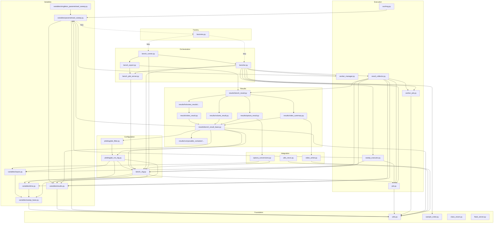

# 11 - Module Dependency Graph

## Intra-Package Import Map

### Foundation Layer (No intra-package dependencies)

| Module | External Dependencies |
|--------|----------------------|
| `utils.py` | numpy, xarray, param, hashlib, pathlib, uuid4 |
| `sample_order.py` | strenum |
| `class_enum.py` | strenum, importlib |
| `flask_server.py` | flask, flask_cors |

### Variable Layer (Depends on: utils)

| Module | Intra-Package Imports | External Dependencies |
|--------|----------------------|----------------------|
| `variables/sweep_base.py` | `utils.hash_sha1` | param, numpy, panel |
| `variables/inputs.py` | `variables.sweep_base.SweepBase, shared_slots` | param, numpy, yaml |
| `variables/results.py` | `utils.hash_sha1` | param, panel |
| `variables/time.py` | `variables.sweep_base.SweepBase, shared_slots` | param, datetime |
| `variables/parametrised_sweep.py` | `utils.make_namedtuple, hash_sha1`; `variables.results.ALL_RESULT_TYPES, ResultHmap`; `factories.create_bench, create_bench_runner` | param, holoviews |
| `variables/singleton_parametrized_sweep.py` | `variables.parametrised_sweep.ParametrizedSweep` | param |

### Configuration Layer (Depends on: Variable Layer)

| Module | Intra-Package Imports |
|--------|----------------------|
| `bench_cfg.py` | `variables.sweep_base.hash_sha1, describe_variable`; `variables.time.TimeSnapshot, TimeEvent`; `variables.results.OptDir`; `job.Executors`; `results.laxtex_result.to_latex` |
| `plotting/plt_cnt_cfg.py` | `bench_cfg.BenchCfg`; `variables.results.PANEL_TYPES`; `variables.inputs.IntSweep, FloatSweep, BoolSweep, EnumSweep, StringSweep, YamlSweep`; `variables.time.TimeSnapshot` |
| `plotting/plot_filter.py` | `plotting.plt_cnt_cfg.PltCntCfg` |

### Execution Layer (Depends on: Configuration Layer)

| Module | Intra-Package Imports |
|--------|----------------------|
| `job.py` | `utils.hash_sha1` |
| `worker_job.py` | `utils.hmap_canonical_input` |
| `worker_manager.py` | `variables.parametrised_sweep.ParametrizedSweep` |
| `sweep_executor.py` | `bench_cfg.BenchCfg, BenchRunCfg`; `job.FutureCache`; `variables.parametrised_sweep.ParametrizedSweep` |
| `result_collector.py` | `bench_cfg.BenchCfg, BenchRunCfg, DimsCfg`; `results.bench_result.BenchResult`; `variables.inputs.IntSweep`; `variables.time.TimeSnapshot, TimeEvent`; `variables.results.*`; `worker_job.WorkerJob`; `job.JobFuture` |
| `caching.py` | `variables.parametrised_sweep.ParametrizedSweep`; `utils.hash_sha1` |

### Result Layer (Depends on: Configuration + Variable Layers)

| Module | Intra-Package Imports |
|--------|----------------------|
| `results/bench_result_base.py` | `utils.*`; `variables.parametrised_sweep.ParametrizedSweep`; `variables.inputs.with_level`; `variables.results.OptDir, ResultVar, ResultReference, ResultDataSet`; `plotting.plot_filter.VarRange, PlotFilter`; `results.composable_container.composable_container_panel.ComposableContainerPanel`; `bench_cfg.BenchCfg`; `plotting.plt_cnt_cfg.PltCntCfg` |
| `results/video_result.py` | `results.bench_result_base.BenchResultBase` |
| `results/volume_result.py` | `plotting.plot_filter.VarRange`; `results.bench_result_base.BenchResultBase, ReduceType`; `variables.results.ResultVar` |
| `results/holoview_results/holoview_result.py` | `results.video_result.VideoResult`; `utils.*` |
| `results/holoview_results/scatter_result.py` | `results.holoview_results.holoview_result.HoloviewResult`; `plotting.plot_filter.VarRange`; `variables.results.*` |
| `results/holoview_results/line_result.py` | `results.holoview_results.holoview_result.HoloviewResult`; `plotting.plot_filter.VarRange` |
| `results/holoview_results/heatmap_result.py` | `results.holoview_results.holoview_result.HoloviewResult`; `plotting.plot_filter.VarRange` |
| `results/holoview_results/bar_result.py` | `results.holoview_results.holoview_result.HoloviewResult`; `plotting.plot_filter.VarRange`; `variables.results.*` |
| `results/bench_result.py` | All result type modules (15 imports) |
| `results/video_summary.py` | `results.bench_result_base.*`; `variables.results.*`; `plotting.plot_filter.*`; `utils.*`; `video_writer.VideoWriter`; `results.video_controls.VideoControls`; `results.composable_container.composable_container_video.*` |
| `results/optuna_result.py` | `results.bench_result_base.BenchResultBase`; `optuna_conversions.*` |
| `results/histogram_result.py` | `results.video_result.VideoResult`; `results.bench_result_base.ReduceType`; `plotting.plot_filter.VarRange`; `variables.results.ResultVar` |

### Orchestration Layer (Top-level, depends on everything)

| Module | Intra-Package Imports |
|--------|----------------------|
| `bencher.py` | `worker_job.WorkerJob`; `bench_cfg.BenchCfg, BenchRunCfg`; `bench_plot_server.BenchPlotServer`; `bench_report.BenchReport`; `variables.inputs.IntSweep`; `variables.results.ResultHmap`; `results.bench_result.BenchResult`; `variables.parametrised_sweep.ParametrizedSweep`; `job.*`; `utils.*`; `sample_order.SampleOrder`; `worker_manager.WorkerManager`; `result_collector.ResultCollector`; `sweep_executor.SweepExecutor, worker_kwargs_wrapper` |
| `bench_runner.py` | `bench_cfg.BenchRunCfg, BenchCfg`; `variables.parametrised_sweep.ParametrizedSweep`; `bencher.Bench`; `bench_report.BenchReport, GithubPagesCfg` |
| `bench_report.py` | `results.bench_result.BenchResult`; `bench_plot_server.BenchPlotServer`; `bench_cfg.BenchRunCfg` |
| `bench_plot_server.py` | `bench_cfg.BenchCfg, BenchPlotSrvCfg` |

### Integration Layer

| Module | Intra-Package Imports | External Dependencies |
|--------|----------------------|----------------------|
| `optuna_conversions.py` | `bench_cfg.BenchCfg`; `variables.inputs.*`; `variables.time.*`; `variables.parametrised_sweep.ParametrizedSweep` | optuna |
| `utils_rerun.py` | `utils.publish_file, gen_rerun_data_path` | rerun, rerun_notebook |
| `video_writer.py` | `utils.gen_video_path, gen_image_path` | moviepy, PIL |

### Factory Layer (Circular Dependency Break)

| Module | Intra-Package Imports |
|--------|----------------------|
| `factories.py` | **TYPE_CHECKING only**: `bencher.Bench`, `bench_runner.BenchRunner`, `bench_cfg.BenchRunCfg`, `bench_report.BenchReport`, `variables.parametrised_sweep.ParametrizedSweep`. **Lazy (inside functions)**: `bencher.Bench`, `bench_runner.BenchRunner`, `bench_cfg.BenchRunCfg` |

## Mermaid Dependency Diagram



## Circular Dependency Analysis

### Primary Circular Dependency

```
ParametrizedSweep (parametrised_sweep.py)
    → to_bench() / to_bench_runner()
    → factories.create_bench() / create_bench_runner()
    → Bench (bencher.py) / BenchRunner (bench_runner.py)
    → BenchCfg (bench_cfg.py)
    → uses ParametrizedSweep parameters
```

### Resolution: `factories.py`

The `factories.py` module breaks this cycle using two techniques:

1. **`TYPE_CHECKING` guard** (compile-time only):
   ```python
   from __future__ import annotations
   from typing import TYPE_CHECKING
   if TYPE_CHECKING:
       from bencher.bencher import Bench
       from bencher.bench_runner import BenchRunner
   ```

2. **Lazy imports** (inside function bodies):
   ```python
   def create_bench(sweep, name=None, ...):
       from bencher.bencher import Bench  # Import at call time
       return Bench(name=name, worker=sweep, ...)
   ```

This ensures the import chain is never circular at module load time.

### Other Potential Cycles

- `bench_cfg.py` imports from `job.py` (for `Executors`), and `job.py` imports from `utils.py` only - no cycle.
- `result_collector.py` imports from `results/bench_result.py`, which imports from all result types. These result types import from `bench_result_base.py`, which imports from `bench_cfg.py`. No cycle because `bench_cfg.py` does not import from results.

## Layered Architecture Summary

```
┌─────────────────────────────────────────────┐
│          Orchestration Layer                 │
│   bencher.py, bench_runner.py,              │
│   bench_report.py, bench_plot_server.py     │
├─────────────────────────────────────────────┤
│          Execution Layer                     │
│   sweep_executor.py, result_collector.py,   │
│   worker_manager.py, worker_job.py, job.py  │
├─────────────────────────────────────────────┤
│          Results Layer                       │
│   bench_result.py, bench_result_base.py,    │
│   holoview_results/*, composable_container/*│
├─────────────────────────────────────────────┤
│          Configuration Layer                 │
│   bench_cfg.py, plt_cnt_cfg.py,            │
│   plot_filter.py                            │
├─────────────────────────────────────────────┤
│          Variables Layer                     │
│   parametrised_sweep.py, inputs.py,        │
│   results.py, time.py, sweep_base.py       │
├─────────────────────────────────────────────┤
│          Foundation Layer                    │
│   utils.py, sample_order.py, class_enum.py │
└─────────────────────────────────────────────┘
        ↕ (lazy)
   factories.py
```

## External Dependency Usage Map

| External Library | Used By |
|-----------------|---------|
| `param` | sweep_base.py, inputs.py, results.py, parametrised_sweep.py, bench_cfg.py, plt_cnt_cfg.py, bench_result_base.py |
| `numpy` | utils.py, inputs.py, sweep_base.py, result_collector.py, video_writer.py |
| `xarray` | utils.py, result_collector.py, bench_result_base.py |
| `pandas` | bench_result_base.py, result_collector.py |
| `holoviews` | parametrised_sweep.py, holoview_result.py, all holoview result types |
| `panel` | sweep_base.py, bench_result_base.py, bench_plot_server.py, bench_report.py, composable_container_panel.py |
| `plotly` | volume_result.py, surface_result.py |
| `diskcache` | job.py, bench_plot_server.py, caching.py |
| `optuna` | optuna_conversions.py, optuna_result.py |
| `moviepy` | video_writer.py |
| `PIL` | video_writer.py |
| `strenum` | sample_order.py, class_enum.py, job.py |
| `sklearn` | optuna_conversions.py (via optuna) |
| `rerun` / `rerun_notebook` | utils_rerun.py |
| `flask` / `flask_cors` | flask_server.py |
| `hvplot` | explorer_result.py |
