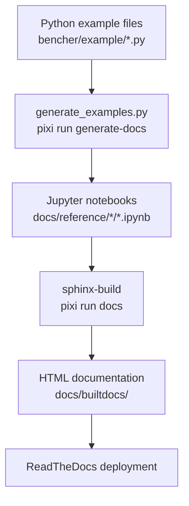

# 12 - Examples & Documentation Generation

## Example Registration Process

### Generator Script: `bencher/example/meta/generate_examples.py`

The documentation generation pipeline converts Python example scripts into Jupyter notebooks that can be rendered by Sphinx for the ReadTheDocs site.

### Core Function: `convert_example_to_jupyter_notebook()` (`generate_examples.py`)

```python
def convert_example_to_jupyter_notebook(filename, output_path, repeats=1):
    """Convert a Python example file to a Jupyter notebook.

    Args:
        filename: Path to the .py example file
        output_path: Output directory for the .ipynb file
        repeats: Number of benchmark repeats (default 1 for fast docs)
    """
```

This function:
1. Reads the Python source file
2. Creates a Jupyter notebook with 3 cells:
   - **Cell 1** (Markdown): Title derived from filename
   - **Cell 2** (Code): Imports and setup with `%%capture` magic to suppress output
   - **Cell 3** (Code): Plotting and display calls
3. Writes the `.ipynb` file to the output path

### Registration

Examples are registered manually in the `if __name__ == "__main__"` block of `generate_examples.py`. Each registration is a call to `convert_example_to_jupyter_notebook()`:

```python
# Example registration pattern:
convert_example_to_jupyter_notebook(
    "bencher/example/example_simple_float.py",
    "docs/reference/1D/"
)
```

### Output Location
Generated notebooks go to `docs/reference/{gallery_subdirectory}/ex_{example_name}.ipynb`

## Gallery Organization by Input Dimensionality

The examples and their gallery placement follow a dimensional organization:

| Gallery Directory | Description | Example Pattern |
|------------------|-------------|-----------------|
| `docs/reference/0D/` | No input parameters | `inputs_0D/example_0_in_*.py` |
| `docs/reference/1D/` | 1 input parameter | `inputs_1D/example_1_*.py`, `example_simple_float.py` |
| `docs/reference/2D/` | 2 input parameters | `inputs_2D/example_2_*.py` |
| `docs/reference/inputs_0_float/` | 0 float + N categorical | `inputs_0_float/example_*_cat_*.py` |
| `docs/reference/inputs_1_float/` | 1 float + N categorical | `inputs_1_float/example_1_float_*.py` |
| `docs/reference/inputs_2_float/` | 2 float + N categorical | `inputs_2_float/example_2_float_*.py` |
| `docs/reference/inputs_3_float/` | 3 float + N categorical | `inputs_3_float/example_3_float_*.py` |
| `docs/reference/levels/` | Level-based sampling | `example_levels.py` |
| `docs/reference/meta/` | Meta-generated examples | `meta/example_meta*.py` |
| `docs/reference/pareto/` | Optimization examples | `example_pareto.py` |
| `docs/reference/yaml/` | YAML-driven sweeps | `example_yaml_*.py` |

### Dimensional Example Source Directories

| Source Directory | Float Inputs | Categorical Inputs | Output Count |
|-----------------|-------------|-------------------|-------------|
| `bencher/example/inputs_0D/` | 0 | 0 | 1-2 |
| `bencher/example/inputs_0_float/` | 0 | 0-3 | 2 |
| `bencher/example/inputs_1D/` | 0-1 | 0-2 | 1-2 |
| `bencher/example/inputs_2D/` | 0 | 2 | 4 |
| `bencher/example/inputs_1_float/` | 1 | 0-3 | 2 |
| `bencher/example/inputs_2_float/` | 2 | 0-3 | 2 |
| `bencher/example/inputs_3_float/` | 3 | 0-3 | 2 |

The naming convention `example_{N}_float_{M}_cat_in_{K}_out.py` encodes the input/output configuration.

## Meta-Example System

### BenchableObject (`bencher/example/meta/example_meta.py:29-74`)
A reusable benchmark with configurable inputs:
- 3 float inputs: `theta`, `offset`, `noise_distribution`
- 3 categorical inputs: `noisy`, `noise_type`, `sample_count`
- Multiple result types: `distance` (ResultVar), `sample_efficiency` (ResultVar)

### BenchMeta (`bencher/example/meta/example_meta.py:77-141`)
A metaclass that sweeps over **variable configurations** - it generates examples by varying which inputs are used:
- Takes lists of float_vars and categorical_vars
- For each combination, runs a benchmark and generates output

### BenchMetaGen (`bencher/example/meta/generate_meta.py:9-147`)
Advanced metaclass with dynamic variable discovery and notebook generation:
- Auto-discovers input/result variables from a ParametrizedSweep
- Generates all valid combinations of float and categorical inputs
- Creates notebooks for each combination

### Meta-Example Variants
| File | Purpose |
|------|---------|
| `example_meta.py` | Base meta-example template |
| `example_meta_cat.py` | Categorical-focused meta examples |
| `example_meta_float.py` | Float-focused meta examples |
| `example_meta_levels.py` | Level-based sampling meta examples |

## Doc Generation Pipeline



### Pipeline Steps

1. **Author example**: Create `.py` file in `bencher/example/` following the benchmark pattern
2. **Register**: Add `convert_example_to_jupyter_notebook()` call in `generate_examples.py`
3. **Generate**: `pixi run generate-docs` executes `generate_examples.py`
4. **Build docs**: `pixi run docs` runs Sphinx to build HTML from notebooks + RST files
5. **Deploy**: ReadTheDocs auto-builds on push

### Example File Structure

Each example follows this pattern:

```python
import bencher as bch

class MyBenchmark(bch.ParametrizedSweep):
    # Input parameters
    x = bch.FloatSweep(default=0, bounds=(0, 10))

    # Result variables
    y = bch.ResultVar(units="m")

    def __call__(self, **kwargs):
        self.update_params_from_kwargs(kwargs)
        self.y = self.x ** 2
        return super().__call__()

def example_my_benchmark(run_cfg=None, report=None):
    bench = MyBenchmark().to_bench(run_cfg)
    bench.plot_sweep("x", "y")
    return bench

if __name__ == "__main__":
    example_my_benchmark().report.show()
```

## How to Add a New Example

1. **Create the example file** in `bencher/example/` (or appropriate subdirectory)
2. **Follow the standard pattern**: subclass `ParametrizedSweep`, implement `__call__()`, create a top-level function
3. **Register in `generate_examples.py`**: Add a `convert_example_to_jupyter_notebook()` call with the correct gallery subdirectory
4. **Run `pixi run generate-docs`** to create the notebook
5. **Update docs configuration** if adding a new gallery section (edit `docs/conf.py` and relevant `.rst` files)
6. **Run `pixi run ci`** to verify everything passes

## Example Utilities

### ExampleBenchCfg (`bencher/example/benchmark_data.py`)
Base configuration class providing shared test data and utilities for examples.

### example_utils.py (`bencher/example/example_utils.py`)
Shared utility functions used across multiple examples.

## Special Example Categories

### Experimental (`bencher/example/experimental/`)
Work-in-progress or advanced examples not yet in the main gallery:
- Bokeh/Plotly backend testing
- Hover interaction
- Streaming data
- Template patterns

### Shelved (`bencher/example/shelved/`)
Archived examples no longer actively maintained:
- 2D scatter experiments
- 3D cone visualization
- Kwargs patterns

### Optuna (`bencher/example/optuna/`)
Dedicated Optuna optimization examples demonstrating hyperparameter tuning workflows.
