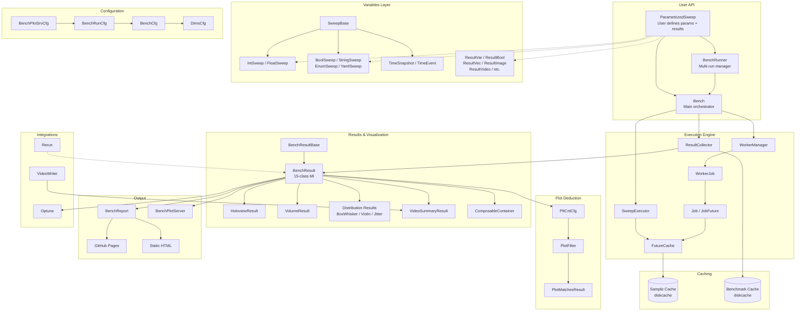

# 13 - Architecture Summary

## High-Level Architecture Diagram



## Key Architectural Patterns

### 1. Multiple Inheritance (Mixin Pattern)
`BenchResult` (`bench_result.py:30`) inherits from **15 parent classes**, each providing a specific visualization method. This diamond-shaped inheritance works because:
- Each parent provides non-overlapping `to_*()` methods
- `BenchResultBase` is the shared root with common state (dataset, config)
- Python's MRO (C3 linearization) resolves method lookup deterministically
- The pattern acts as a mixin system where each result type "plugs in" its visualization

### 2. Protocol Classes
`BenchableV1` and `BenchableV2` (`bench_runner.py:14-28`) define structural typing for benchmark functions:
- V1: `(run_cfg, report) -> BenchCfg` (legacy)
- V2: `(run_cfg) -> BenchCfg` (current)
- `Benchable = BenchableV1 | BenchableV2` union supports both

### 3. Factory Pattern (Circular Dependency Break)
`factories.py` uses lazy imports inside function bodies to break the cycle:
```
ParametrizedSweep → factories → Bench/BenchRunner → BenchCfg → ParametrizedSweep
```
This enables the convenience methods `to_bench()` and `to_bench_runner()` on ParametrizedSweep.

### 4. Delegation Pattern
`Bench` delegates to three internal managers:
- `WorkerManager` - function wrapping and validation
- `SweepExecutor` - variable conversion and cache initialization
- `ResultCollector` - dataset creation and result storage

This separates concerns while keeping `Bench` as the clean public API.

### 5. Hash-Based Caching
Two-tier caching using SHA1 hashes:
- **Sample cache**: Per-function-call results keyed by sorted input hash
- **Benchmark cache**: Complete BenchResult keyed by BenchCfg hash
- `hash_persistent()` avoids PYTHONHASHSEED randomization
- Custom `__bencher_hash__` protocol for user types

### 6. N-Dimensional Data Model
Results stored as `xarray.Dataset` with dimensions matching the Cartesian product of input parameters. This enables:
- Automatic slicing along any dimension
- Natural mapping to plot types (1D → line, 2D → heatmap, 3D → volume)
- Level-based subsampling via `select_level()`

### 7. Plot Deduction
Automatic visualization selection based on data shape:
- `PltCntCfg` classifies inputs as float vs. categorical
- `PlotFilter` specifies valid ranges for each plot type
- `PlotMatchesResult` evaluates compatibility
- All matching plots are included (additive, not exclusive)

### 8. ClassEnum Factory
`ClassEnum` (`class_enum.py:12`) provides enum-to-class mapping via `to_class_generic()` using `importlib` dynamic imports.

## Design Trade-offs and Rationale

### Trade-off: Multiple Inheritance vs. Composition
**Choice**: Multiple inheritance for BenchResult
**Rationale**: Each visualization type needs access to the same xarray dataset and config. MI with mixins avoids wrapping/delegation overhead and keeps the API flat (`result.to_scatter()`, `result.to_heatmap()`, etc.).
**Cost**: Complex MRO, harder to understand initialization order.

### Trade-off: Disk Caching vs. In-Memory
**Choice**: diskcache for persistent storage
**Rationale**: Benchmarks can be expensive. Persistent caching means results survive across sessions. The two-tier system (sample + benchmark) provides both fine-grained and coarse-grained reuse.
**Cost**: Serialization overhead, disk space usage, cache invalidation complexity.

### Trade-off: param Library vs. dataclasses/Pydantic
**Choice**: `param` library for all parameter definitions
**Rationale**: param provides metadata (bounds, units, doc), change notifications, and integrates with Panel/HoloViews. It's the foundation of the HoloViz ecosystem.
**Cost**: Learning curve, magic behavior with descriptors, complex type checking.

### Trade-off: Automatic Plot Selection vs. Explicit
**Choice**: Automatic with override capability
**Rationale**: Users shouldn't need to know which plot type fits their data. The deduction algorithm handles common cases automatically while `plot_callbacks` allows full customization.
**Cost**: Sometimes selects suboptimal plots, users must understand the filter system to customize.

### Trade-off: Cartesian Product vs. Adaptive Sampling
**Choice**: Full Cartesian product (with level-based subsampling)
**Rationale**: Ensures complete coverage of the parameter space. Level-based sampling (`with_level()`) provides progressive refinement.
**Cost**: Exponential scaling with dimensions (mitigated by caching and levels).

## Complexity Areas / Technical Debt

### 1. BenchResult Multiple Inheritance Depth
15-class MI makes the class hard to reason about. Method resolution and `__init__` chains are non-trivial. Consider simplifying with explicit composition or a registry pattern.

### 2. BenchRunCfg Parameter Count
`BenchRunCfg` has 40+ parameters. Many are rarely used. Could benefit from parameter groups or builder pattern.

### 3. bench_result_base.py Size
At 753 lines, `BenchResultBase` handles too many concerns: dataset conversion, reduction, optimization, filtering, layout. Could be split into focused modules.

### 4. Result Type Proliferation
12 result types with overlapping capabilities (e.g., ResultPath vs ResultImage vs ResultVideo are all filenames). The type system could be simplified.

### 5. SCOOP Executor
The SCOOP distributed executor (`job.py`) is commented out but still present in the enum. Should be either implemented or removed.

### 6. Legacy CachedParams
`caching.py` contains `CachedParams` which duplicates functionality now in `FutureCache`. Could be deprecated/removed.

### 7. Inconsistent Import Styles
`__init__.py` mixes relative and absolute imports. Some modules use relative, others absolute. Should standardize.

### 8. plot_filter Matching Semantics
`PlotFilter` uses VarRange bounds that can be confusing (e.g., `cat_range: -1-0` means "allow -1 to 0 categorical variables"). Negative bounds have unclear semantics.

## Suggested Reading Order for New Developers

1. **Start**: `README.md` - Overall purpose and quickstart
2. **Example**: `bencher/example/example_simple_float.py` - See the API in action
3. **Config**: `bencher/variables/parametrised_sweep.py` - How parameters are defined
4. **Variables**: `bencher/variables/inputs.py` + `results.py` - Sweep and result types
5. **Core**: `bencher/bencher.py` - Main orchestration flow
6. **Data**: `bencher/bench_cfg.py` - Configuration system
7. **Execution**: `bencher/job.py` + `sweep_executor.py` - How jobs are run and cached
8. **Results**: `bencher/results/bench_result_base.py` - Result handling and reduction
9. **Plots**: `bencher/plotting/plot_filter.py` + `plt_cnt_cfg.py` - Plot deduction
10. **Visualization**: Pick specific result types as needed (scatter, line, heatmap, etc.)
11. **Advanced**: `bencher/bench_runner.py` - Multi-run management
12. **Integrations**: Optuna, Rerun, report generation as needed
